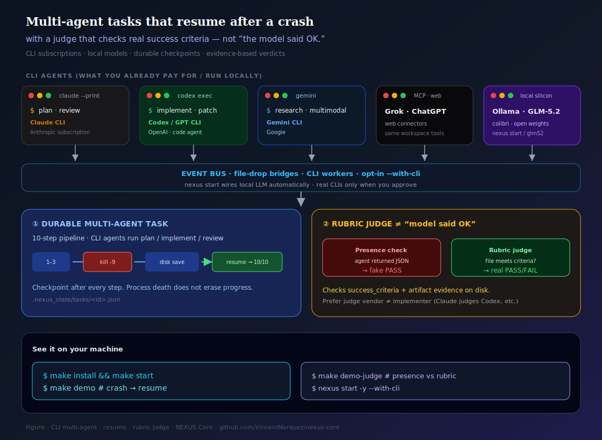
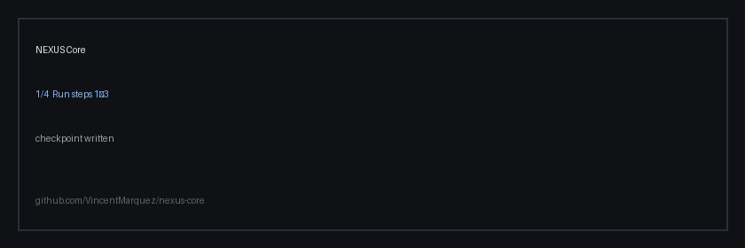
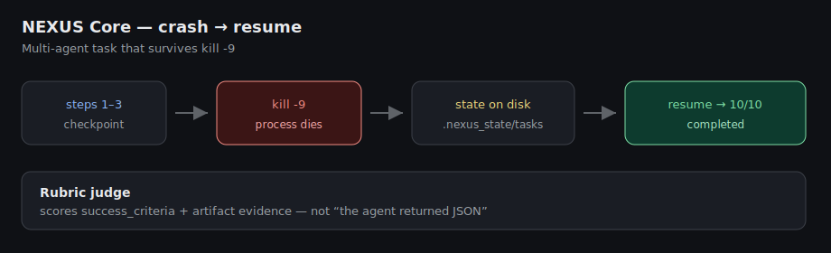
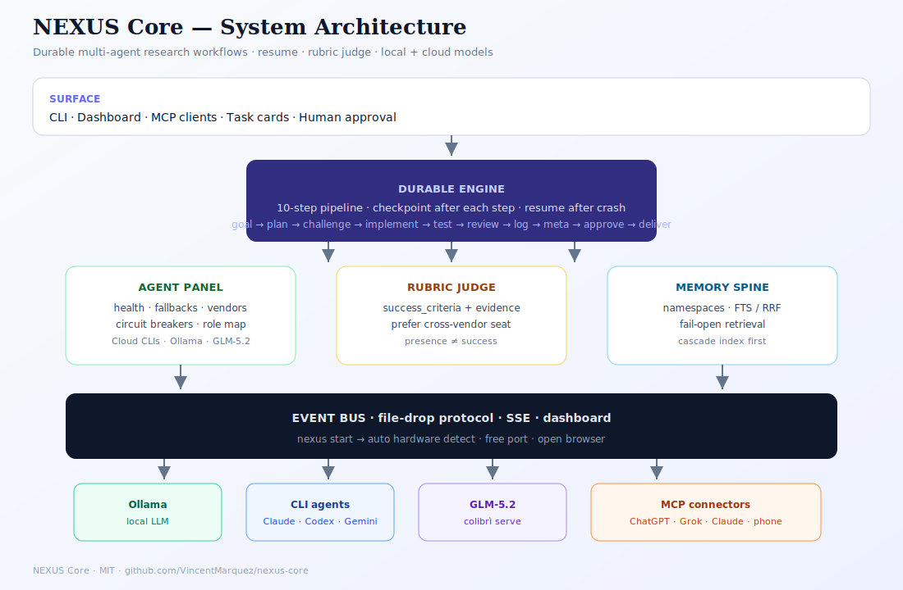
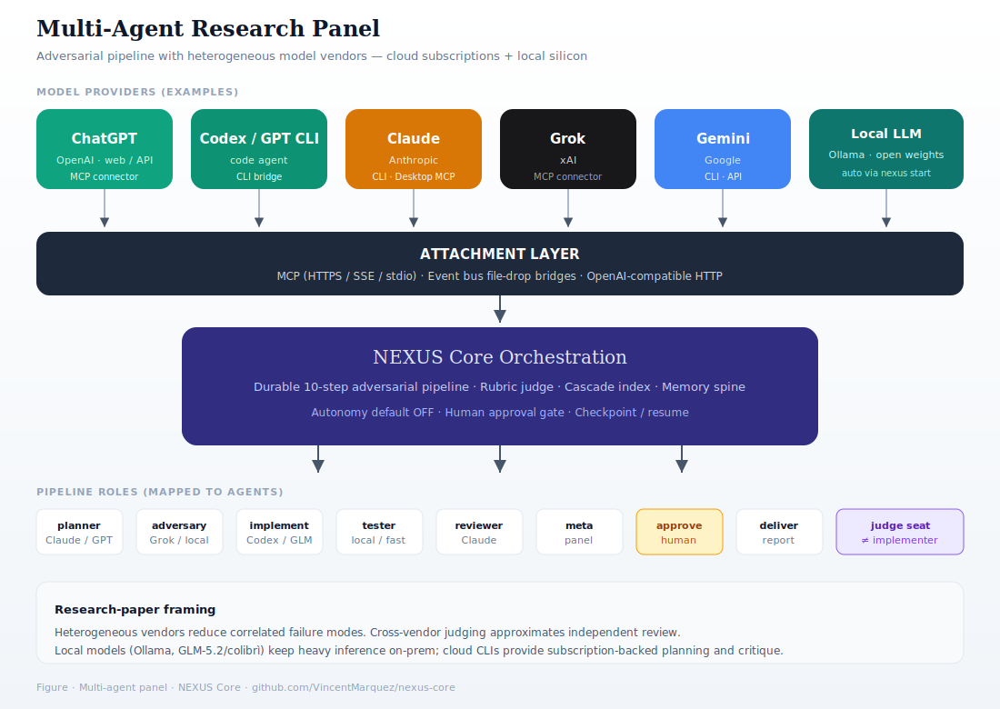
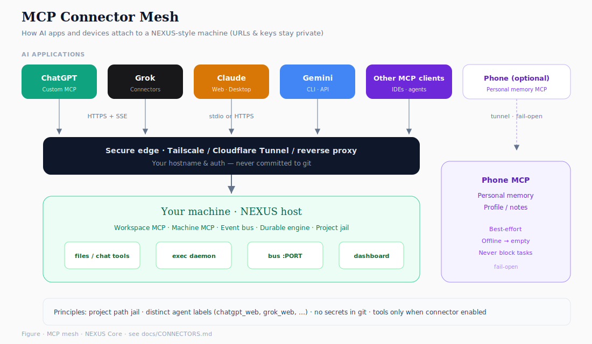
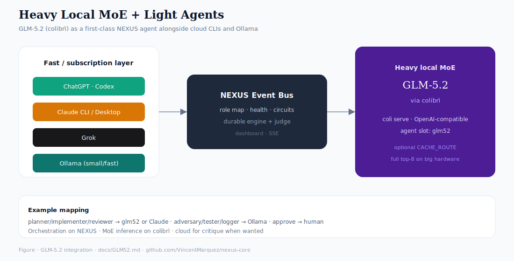
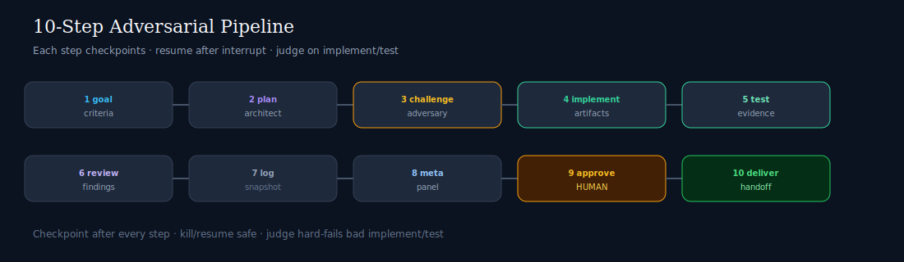

# NEXUS Core

[](https://github.com/VincentMarquez/nexus-core/actions/workflows/ci.yml)
[](LICENSE)
[](https://www.python.org/downloads/)
[](https://vincentmarquez.github.io/nexus-core/)
[](https://pypi.org/project/nexus-core/)

**Multi-agent tasks that resume after a crash — with a judge that checks real success criteria, not “the model said OK.”**









```bash
# from source
git clone https://github.com/VincentMarquez/nexus-core
cd nexus-core && make install && make start

# or (when published): pip install nexus-core && nexus start -y
```

**What `make start` / `nexus start` does automatically:**

1. Detects CPU / RAM / GPU (and unified memory)  
2. Starts **Ollama** if installed and picks a safe local model (pulls one if you approve / `-y`)  
3. Starts the **JS event bus** + opens the **dashboard in your browser**  
4. Wires a **local LLM bridge** (or mock if Ollama is missing)  
5. Keeps real **CLI agents off** until you pass `--with-cli` or approve the prompt  

Then:

```bash
make demo          # crash → resume proof
nexus status       # what's running
nexus stop         # tear down
```

> If this saves you a failed overnight agent run, a star helps others find it.

---

## Why it exists

Multi-agent systems fail in the same boring ways:

| Failure mode | NEXUS Core response |
|--------------|---------------------|
| Process dies mid-task | **Durable checkpoints** + resume |
| “Validator” only checks that someone replied | **Rubric judge** on criteria + artifacts |
| Agents thrash context opening random files | **Cascade index** (shallow map first) |
| Background loops burn tokens | **Autonomy default OFF** |
| Cloud-only agent wiring | **Event bus + CLI / Ollama bridges** |

---

## 60-second proof

```bash
make install
make start         # hardware + bus + dashboard + local LLM
make demo          # crash → resume → completed
make demo-judge    # presence trap vs rubric judge
make smoke         # full eval suite
nexus stop
```

### CLI cheatsheet

| Command | Does |
|---------|------|
| `nexus doctor` | Print hardware + tool detection |
| `nexus start` | Full auto stack (prompts for model pull / CLI) |
| `nexus start -y` | Non-interactive defaults |
| `nexus start -y --with-cli` | Also enable installed CLIs (claude/codex/…) |
| `nexus start --model gemma4:e4b` | Force a model |
| `nexus status` | PIDs + bus health |
| `nexus stop` | Stop bus + bridges |
| `nexus demo` | Crash/resume demo |
| `nexus mcp --http` | Workspace MCP tools API |
| `nexus mcp` | Stdio MCP (Claude Desktop) |

Dashboard URL after start: printed in the terminal (auto port if 3099 is busy).

### Connect AI subscriptions & phone (MCP)

NEXUS-style setups attach **ChatGPT / Claude / Grok** (and optional **phone memory**) as MCP connectors — your URLs and keys stay local.

| Doc | Contents |
|-----|----------|
| [docs/CONNECTORS.md](docs/CONNECTORS.md) | Architecture: remote MCP, machine MCP, phone MCP, bus |
| [docs/MCP_SETUP.md](docs/MCP_SETUP.md) | Recipes for each AI app |
| [connectors/](connectors/) | Copy-paste JSON/env **templates** (placeholders only) |

```text
ChatGPT / Grok  ──HTTPS MCP──►  your tunnel  ──►  workspace tools on the machine
Claude Desktop  ──stdio MCP──►  machine-mcp.js  ──►  files + supervised shell
Phone (optional)──HTTPS MCP──►  tunnel        ──►  personal memory (fail-open)
Ollama / CLIs   ──event bus──►  nexus start
GLM-5.2 colibrì ──event bus──►  colibri-glm bridge (coli serve)
```

### GLM-5.2 (colibrì) as a NEXUS agent

On a large box (high RAM / GB10-class), run **colibrì** next to NEXUS and attach GLM as agent `glm52`:

```bash
# coli serve …  (your COLI_MODEL)
nexus start -y
./bridge/bridges/colibri-glm.sh glm52
python examples/run_with_bus.py --map planner=glm52,implementer=glm52,tester=local
```

Guide: **[docs/GLM52.md](docs/GLM52.md)** · quick start: [examples/glm52_nexus.md](examples/glm52_nexus.md)  
Measurements / CACHE_ROUTE notes: [VincentMarquez/glm52-gb10-colibri](https://github.com/VincentMarquez/glm52-gb10-colibri)

---

## Architecture











All figures: [docs/FIGURES.md](docs/FIGURES.md)  
Docs: [ARCHITECTURE](docs/ARCHITECTURE.md) · [PIPELINE](docs/PIPELINE.md) · [CONNECTORS](docs/CONNECTORS.md) · [GLM-5.2](docs/GLM52.md) · [BRIDGES](docs/BRIDGES_AND_BUS.md)

---

## 10-step pipeline

| # | Step | Role |
|---|------|------|
| 1 | goal | objective + success criteria |
| 2 | plan | approach |
| 3 | challenge | adversarial review |
| 4 | implement | artifacts |
| 5 | test | evidence |
| 6 | review | verdict |
| 7 | log | snapshot |
| 8 | meta_review | panel review |
| 9 | **approval** | **human gate** |
| 10 | deliver | handoff |

---

## Cookbooks

1. [Crash → resume](cookbook/01_crash_resume.md)
2. [Judge vs presence](cookbook/02_judge_vs_presence.md)
3. [Local LLM (Ollama)](cookbook/03_local_llm_ollama.md)
4. [Workspace MCP](cookbook/04_workspace_mcp.md)
5. [GLM-5.2 / colibrì](cookbook/05_glm52_colibri.md)

Docs site: https://vincentmarquez.github.io/nexus-core/

## Features

| | |
|--|--|
| Durable engine + resume | ✅ |
| Rubric-style judge | ✅ |
| Mock agents (zero setup) | ✅ |
| SQLite FTS memory | ✅ |
| Circuit breakers | ✅ |
| Event bus + SSE + task API | ✅ |
| Minimal dashboard | ✅ |
| Ollama + CLI bridges | ✅ |
| Human approve CLI | ✅ |
| Smoke evals + scoreboard | ✅ |
| Docker Compose bus | ✅ |
| GitHub Actions CI | ✅ |

---

## Install

```bash
git clone https://github.com/VincentMarquez/nexus-core
cd nexus-core
make install    # python venv + editable install
make test
```

**Python 3.10+**. Node 18+ optional (bus/dashboard). Ollama optional (local models).

---

## Repository layout

```
src/nexus/     engine, judge, memory, bus client, circuits
bridge/        event bus, bridges, dashboard
examples/      demos
evals/         smoke suite + scoreboard
data/          vendor map + routing table
docs/          architecture + growth notes
```

---

## Contributing

See [CONTRIBUTING.md](CONTRIBUTING.md). Design principles stay stable: **presence ≠ success**, **resume over hope**, **autonomy opt-in**.

```bash
make test && make smoke
```

---

## Learn more

| Doc | Purpose |
|-----|---------|
| [docs/COMPARE.md](docs/COMPARE.md) | vs DIY / chat agents / graph runners |
| [docs/VIDEO_SCRIPT.md](docs/VIDEO_SCRIPT.md) | 60s product video + lab story video |
| [docs/SHOW_HN.md](docs/SHOW_HN.md) | Ready-to-post Show HN |
| [docs/SOCIAL_POSTS.md](docs/SOCIAL_POSTS.md) | X / LinkedIn / Reddit copy |
| [docs/LAUNCH_CHECKLIST.md](docs/LAUNCH_CHECKLIST.md) | Launch day checklist |
| [docs/X_RELEASE.md](docs/X_RELEASE.md) | How to post on X (your account) |
| [docs/META_REVIEW.md](docs/META_REVIEW.md) | Launch readiness meta-review |
| [docs/CONNECTORS.md](docs/CONNECTORS.md) | MCP + AI subscriptions + phone |
| [docs/MCP_SETUP.md](docs/MCP_SETUP.md) | How to attach ChatGPT / Claude / Grok |
| [docs/GROWTH.md](docs/GROWTH.md) | Research on how high-star repos grow |

---

## Citation

```text
Vincent Marquez, NEXUS Core, 2026
https://github.com/VincentMarquez/nexus-core
```

## License

MIT — [LICENSE](LICENSE)
