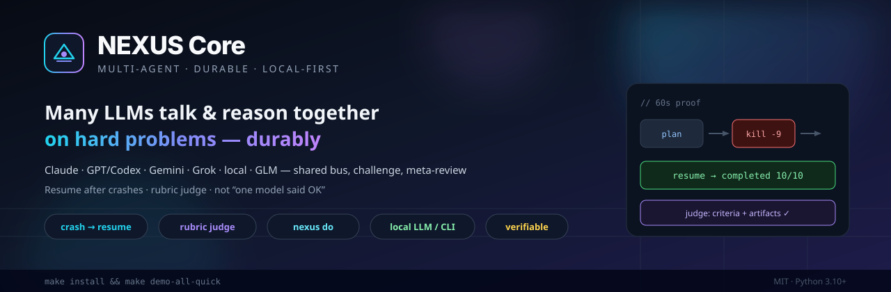
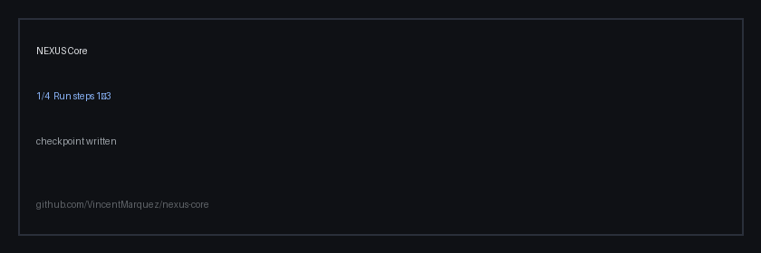
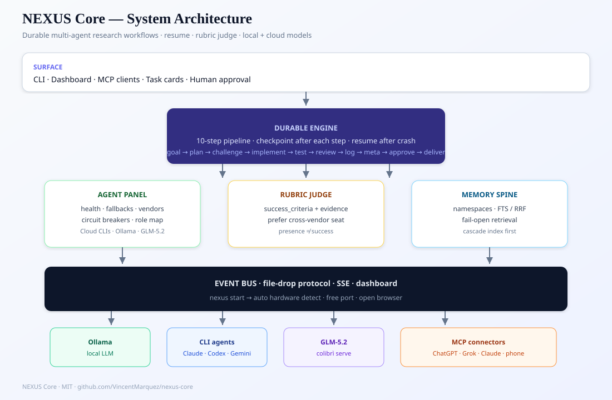

<p align="center">
  
</p>

<p align="center">
  <a href="https://github.com/VincentMarquez/nexus-core/actions/workflows/ci.yml"></a>
  <a href="LICENSE"></a>
  <a href="https://www.python.org/downloads/"></a>
  <a href="https://github.com/VincentMarquez/nexus-core/releases"></a>
  <a href="https://github.com/VincentMarquez/nexus-core/stargazers"></a>
</p>

<p align="center">
  <b>Build your dream with a durable, evidence-driven AI team.</b><br>
  NEXUS coordinates local and cloud agents to research, challenge, build, test, and review ambitious work inside one inspectable workspace.<br>
  <b>Repository engineering · Deep research · NEXUS self-improvement · arXiv discovery · Mathematics · X research and social review · Business workflows</b>
</p>

<p align="center">
  <a href="#quick-start"><b>Quick start</b></a> ·
  <a href="#what-the-demo-proves"><b>Proof</b></a> ·
  <a href="#how-it-works"><b>Architecture</b></a> ·
  <a href="#deep-dives"><b>Deep dives</b></a> ·
  <a href="#safety-boundaries"><b>Safety</b></a>
</p>

NEXUS is compact at its core and expansive in what it can coordinate. It is an
inspectable orchestration engine for ambitious work that should survive crashes,
continue across model sessions, and never be considered complete merely because
an agent says it is.

Give NEXUS a goal and it assembles a coordinated team around it:

- Build, repair, and validate software repositories
- Search, retrieve, and analyze arXiv research
- Investigate mathematical and technical ideas
- Review public posts, discussions, and research signals from X
- Compare findings across local and cloud models
- Improve NEXUS through its own controlled research and implementation loop
- Support business, procurement, and decision-analysis workflows

Work moves through a structured pipeline:

**plan → challenge → implement → test → review**

Each step is checkpointed. Criteria, artifacts, test results, and reviewer
judgments are recorded so work can be resumed, inspected, challenged, and
independently verified.

NEXUS can run entirely with deterministic fixtures and mock agents for
reproducible evaluation, or connect to separately installed local and cloud
model clients. Model names, providers, hardware, and endpoints are
configuration—not product requirements.

**One workspace. Many models. A real path from idea to evidence.**

## Quick start

Requirements: Python 3.10+, Git, Make, and a POSIX shell.

```bash
git clone https://github.com/VincentMarquez/nexus-core.git
cd nexus-core
make install
source .venv/bin/activate
make demo-all-quick
nexus task list
```

The source checkout is currently the canonical installation. `make install`
creates `.venv` and installs NEXUS in editable mode. The quick demo does not need
API keys or Node.js.

Want the shortest proof instead?

```bash
make demo
```

That command simulates a crash after step 3, resumes the same task, and verifies
that it reaches step 10 with the expected artifact. See
[Crash → resume](docs/cookbook/01_crash_resume.md) for the checkpoints and event
journal.

### Start the local bus and dashboard

The runtime stack requires Node.js 18+. This source-checkout command detects
installed model CLIs and Ollama, starts the local bus and dashboard, and fills
unavailable agent slots with mock bridges:

```bash
./run --no-pull
```

`--no-pull` prevents an automatic Ollama model download. Add `--no-open` to keep
the command from opening a browser, or `--no-cli` to disable installed model
CLIs. Read [Getting started](docs/getting-started.md) and
[Model platforms](docs/PLATFORMS.md) before enabling real providers.

### Run a repository task

After activating the virtual environment:

```bash
nexus do owner/repo --goal "run the checks and repair the failures"
```

This may clone the target and run its installers, build hooks, Make targets, and
tests. That executes repository-controlled code; NEXUS is not a sandbox. Use a
trusted commit or an isolated, credential-free environment. The
[repository-repair cookbook](docs/cookbook/06_github_do.md) explains the full
flow and its boundaries.

## What the demo proves

`make demo-all-quick` runs a local, reproducible product check:

| Check | Evidence |
|---|---|
| Unit suite | The current checkout passes its pytest suite |
| Crash recovery | A task is interrupted, loaded from disk, and completed |
| Rubric judging | An artifact-presence claim is rejected until criteria hold |
| Engine smoke cases | Complete, resume, autonomy-block, and human-gate paths run |
| Platform discovery | Available model clients are reported without requiring them |
| Resilience probe | Network diagnosis and heartbeat dry-run paths execute |

Quick mode skips the optional GitHub-auth check and scoreboard. It does not test
live model quality, run the real self-improvement loop, or exercise the
capability factory. Those require separate configuration and evidence.

<p align="center">
  
</p>

More detail: [Demo guide](docs/DEMO.md) ·
[Judge vs presence](docs/cookbook/02_judge_vs_presence.md) ·
[Evidence format](docs/evidence/README.md)

## Why NEXUS

| Common failure | NEXUS response |
|---|---|
| A long agent run dies with its process | Atomic checkpoints plus an append-only event journal support resume |
| “The model said it passed” becomes the acceptance test | A separate judge scores declared criteria and artifact evidence |
| One model reinforces its own blind spots | Planner, adversary, implementer, tester, reviewer, and meta-review roles can use different backends |
| Agents repeatedly reopen the same context | Bounded context packs, handoffs, and optional namespaced memory |
| Automation runs without an operator trail | Replay, provenance, integrity, cost, graph, and evidence exports |

NEXUS is intentionally closer to a durable job runner than a model chat room.
It provides orchestration primitives; it does not guarantee model correctness,
safe execution of untrusted code, or distributed fault tolerance.

## How it works

<p align="center">
  
</p>

The default policy has ten stages:

```text
goal → plan → challenge → implement → test
     → review → log → meta-review → approval → deliver
```

| Component | Responsibility |
|---|---|
| Step policy | Declares stages, dependencies, capabilities, and approval points |
| Agent resolver | Maps roles to healthy configured backends with fallbacks |
| Runner | Executes the business logic for one stage |
| Judge | Scores success criteria against structured output and artifacts |
| Checkpointer | Writes task state atomically after each accepted stage |
| Event journal | Records steps, decisions, handoffs, failures, and resumes |
| Operator surface | Replays and exports the resulting evidence |

The local engine provides filesystem-backed recovery on one host. It is not a
distributed scheduler, an exactly-once execution system, or a tamper-evident
ledger. See [Architecture](docs/ARCHITECTURE.md) and the
[10-step pipeline](docs/PIPELINE.md) for the contracts and extension points.

### Execution roles and approval

Planner, adversary, implementer, tester, reviewer, meta-reviewer, and judge
roles can be mapped independently to installed cloud CLIs, an Ollama model,
deterministic fixtures, mocks, or a mixture. A human approval stage can accept,
reject, or return feedback without discarding the checkpointed task.

Exact provider and model identifiers in historical evidence describe those
recorded environments only. Configure identifiers supported by your installed
client or provider. See [Platforms](docs/PLATFORMS.md),
[Local LLM tool calling](docs/LOCAL_LLM_TOOL_CALLING.md), and
[Connectors and MCP](docs/CONNECTORS.md).

## Inspect a run

After `make demo` or another durable task, use the task ID shown by
`nexus task list`:

```bash
nexus task list
nexus task show <task_id>
nexus task replay <task_id>
nexus task explain <task_id>
nexus task verify <task_id>
nexus task evidence <task_id> --out evidence.json
```

These commands inspect recorded state; they do not rerun agents. The
[task-operator cookbook](docs/cookbook/12_task_operator.md) covers additional
events, cost, provenance, call-graph, DAG, consensus, and context views.

## Deep dives

The README is the front door. Use these guides for setup, command details,
design rationale, and evidence:

| I want to… | Start here | More detail |
|---|---|---|
| Install and run the demos | [Getting started](docs/getting-started.md) | [Demo guide](docs/DEMO.md) |
| Understand the engine | [Architecture](docs/ARCHITECTURE.md) | [10-step pipeline](docs/PIPELINE.md) |
| Prove crash recovery | [Crash → resume](docs/cookbook/01_crash_resume.md) | [Task operator](docs/cookbook/12_task_operator.md) |
| Understand evidence-based completion | [Judge vs presence](docs/cookbook/02_judge_vs_presence.md) | [Evidence artifacts](docs/evidence/README.md) |
| Repair a repository | [Repository repair](docs/cookbook/06_github_do.md) | [How models write and test code](docs/HOW_LLMS_WRITE_CODE.md) |
| Connect local or cloud models | [Model platforms](docs/PLATFORMS.md) | [Platforms cookbook](docs/cookbook/10_platforms_local_llm.md) |
| Give a local model host tools | [Local LLM tool calling](docs/LOCAL_LLM_TOOL_CALLING.md) | [Operator-specific Gemma example](skillpacks/gemma-local-tools/SKILL.md) |
| Connect AI clients over MCP | [Connectors](docs/CONNECTORS.md) | [MCP setup](docs/MCP_SETUP.md) · [MCP cookbook](docs/cookbook/04_workspace_mcp.md) |
| Operate GitHub community workflows | [Community guide](docs/GITHUB_COMMUNITY.md) | [Community cookbook](docs/cookbook/09_github_community.md) |
| Inspect Alive/self-improvement | [Alive operator guide](docs/ALIVE.md) | [Self-improve system map](docs/self-improve/README.md) |
| Understand the capability factory | [Current implementation status](docs/system-improve/TRACKER.md) | [Factory design](docs/system-improve/references/SKILLS_AND_TOOLS_FACTORY.md) |
| Work with skill packs | [Skill-pack catalog](skillpacks/README.md) | [Current factory status](docs/system-improve/TRACKER.md) |
| Configure resilience checks | [Resilience](docs/RESILIENCE.md) | [Heartbeat cookbook](docs/cookbook/11_heartbeat_resilience.md) |
| Run an arXiv workflow | [Research agent](docs/agents/RESEARCH_ARXIV.md) | [Research cookbook](docs/cookbook/08_arxiv_research.md) |
| Run procurement analysis | [Procurement agent](docs/agents/PROCUREMENT.md) | [Procurement cookbook](docs/cookbook/07_procurement.md) |
| Compare approaches or see plans | [Comparison](docs/COMPARE.md) | [Roadmap](docs/ROADMAP.md) |
| Review release and packaging work | [Changelog](CHANGELOG.md) | [Publishing guide](docs/PYPI.md) · [Launch checklist](docs/LAUNCH_CHECKLIST.md) |
| Review historical run evidence | [Latest recorded snapshot](docs/share/LAST_REAL.md) | [Detailed implementation record](docs/LATEST_IMPLEMENT_SUMMARY.md) |
| Review security boundaries or report an issue | [Security and trust boundaries](docs/SECURITY.md) | [Reporting policy](SECURITY.md) |

The GitHub community loop, Alive, capability generation, application,
activation, commits, and pushes are advanced operations. Read their guides and
inspect the effective configuration before enabling them.

## Safety boundaries

NEXUS coordinates tools and executes project workflows; it is not a security
sandbox. Read [security and trust boundaries](docs/SECURITY.md) before
running third-party code or enabling remote/write operations.

- **Repository code can execute.** `nexus do` and GitHub proof/test workflows
  may run package installers, build hooks, Make targets, and tests from a
  checkout. A command-name allowlist blocks some obvious commands; it does not
  make untrusted code safe. Child processes inherit the environment and may
  reach CLI credential stores. Use trusted commits or an isolated,
  credential-free container or virtual machine.
- **Public-fork automation requires isolation.** Never execute untrusted pull
  request code in a job that has write-capable credentials. Separate untrusted,
  read-only testing from any trusted job that posts or publishes results.
- **Runtime state may be sensitive.** `.nexus_state/` is gitignored, not
  encrypted. It may contain prompts, outputs, source excerpts, local paths,
  stdout/stderr, task history, and operator feedback. Inspect it before sharing
  and never use it as a secret store.
- **The HTTP tools demo API has no built-in application authentication.** It is
  not the full remote MCP transport described in the connector patterns. Keep
  it bound to localhost and do not expose it directly to the public internet.
- **Path checks are not a complete capability sandbox.** Direct file tools
  reject paths outside `NEXUS_PROJECT_ROOT`, but the wider MCP surface can
  include write and operational tools. Catalog privilege labels describe tools;
  they are not call-time authorization.
- **Publishing acts on the configured repository.** Advanced self-improvement
  paths can modify files, commit, and push when enabled. Use a clean dedicated
  branch, protect the default branch, review the diff, and keep unrelated
  changes out of the worktree.
- **Offline demos are not live-model evaluations.** They prove orchestration,
  recovery, gates, and evidence handling—not the quality, reliability, or
  safety of a real model or provider.

Provider credentials belong in the provider's own authenticated CLI or
environment. Do not commit API keys, OAuth tokens, cookies, tunnel URLs, or
machine-local configuration.

## Project status and limits

- The source checkout is the supported installation path today. The PyPI
  distribution is not yet the canonical runtime install.
- The local runtime is single-host and filesystem-backed.
- Real providers, Ollama, GitHub authentication, remote MCP access, and
  self-publishing are optional integrations with separate setup.
- Missing model clients can be represented by mock bridges; a green offline
  demo does not imply that a live provider was exercised.
- Historical metrics and exact model names are evidence from a recorded run,
  not guarantees about the current branch. See
  [the latest recorded snapshot](docs/share/LAST_REAL.md).

See [Comparison](docs/COMPARE.md) for fit and tradeoffs and
[Roadmap](docs/ROADMAP.md) for planned work.

## Contributing

Issues and pull requests are welcome. Before submitting a change:

```bash
make release-check
```

That target installs the development environment, runs the unit and smoke
suites, validates quality fixtures, and builds the documentation in strict
mode. Read [CONTRIBUTING.md](CONTRIBUTING.md) and the
[Code of Conduct](CODE_OF_CONDUCT.md) first.

Security-sensitive findings should follow [SECURITY.md](SECURITY.md), not a
public issue.

## Citation

```bibtex
@software{nexus_core,
  author = {Vincent Marquez},
  title = {NEXUS Core: Durable, evidence-gated multi-agent execution},
  url = {https://github.com/VincentMarquez/nexus-core}
}
```

## License

[MIT](LICENSE)
