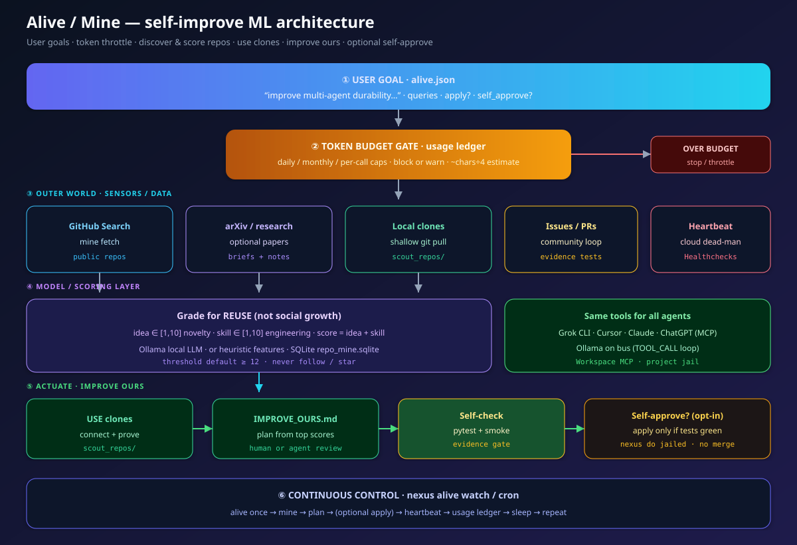

# Alive — self-improving NEXUS under *your* goals + token budget

High-level idea:

> NEXUS can **keep working on itself**: search and research the open ecosystem,  
> score what it finds, use those repos to plan improvements to **your** code,  
> and optionally self-approve when tests pass — while **you** throttle tokens.

> **Advanced operation:** apply, activation, commit, and push paths can modify
> the current checkout and remote directly. Use a clean, dedicated branch or
> worktree, protect the default branch, inspect the effective configuration,
> and review the diff. Repository mining/proof may also install and execute
> code from cloned projects; use an isolated, credential-free environment for
> untrusted inputs.

## ML architecture



Also see the **GitHub community** ML figure: [arch-github-community.svg](assets/arch-github-community.svg) (issues/PRs → tests → write-back).

## The loop

```text
user goal (alive.json)
        │
        ▼
  usage budget check ── over? ──► stop (throttle)
        │
        ▼
  mine: fetch → **Grok grade** (local LLM light fallback) → use clones
        │
        ▼
  improve-ours plan (IMPROVE_OURS.md)
        │
        ├─ self_approve=false → stop (human reviews)
        └─ self_approve=true + apply=true + tests green
                    │
                    ▼
              **Grok hard improve** (or bus worker) → port patterns
                    │
                    ▼
              heartbeat + workspace log + token ledger
```

### Grok vs local LLM

| Work | Default | Config |
|------|---------|--------|
| Hard grading (idea/skill) | **Grok** | `grader: auto\|grok\|ollama\|heuristic` |
| Hard improve / apply | **Grok** | `worker: auto\|grok\|bus` |
| Light bus turns, digests | **Local Ollama** | `use_ollama: true`, `nexus start` |

### arXiv ledger (no double papers)

Seen papers are stored in a spreadsheet-friendly CSV the AI can read:

| File | Role |
|------|------|
| [`docs/ARXIV_LEDGER.csv`](ARXIV_LEDGER.csv) | Open in Excel / LibreOffice; committed to GitHub |
| [`docs/ARXIV_LEDGER.md`](ARXIV_LEDGER.md) | Short markdown table for agents |
| `.nexus_state/arxiv_ledger.csv` | Runtime mirror |

Each research / alive / full-cycle arXiv step **over-fetches**, **drops ids already in the ledger**, records the new ones, and only reuses old papers if not enough new hits exist.

```bash
nexus alive init \
  --goal "improve durability" \
  --grader auto \
  --worker grok \
  --query "multi agent durable"
```

## Commands

```bash
# 1) Cap tokens (everyone should do this)
nexus usage set --daily 200000 --monthly 3000000
nexus usage status

# 2) Tell NEXUS what you want
nexus alive init \
  --goal "improve multi-agent durability, demos, and docs" \
  --query "multi agent durable orchestration" \
  --repo VincentMarquez/nexus-core

# 3) One cycle (plan only by default)
nexus alive once

# 4) Optional: auto-apply when tests pass (opt-in)
nexus alive init --apply --self-approve --repo YOU/REPO
nexus alive once

# 5) Keep living
nexus alive watch --interval 3600
# or cron:
nexus schedule
```

## Token throttle

| Setting | Meaning |
|---------|---------|
| `daily_tokens` | Hard/soft cap per UTC day |
| `monthly_tokens` | Cap per month |
| `per_call_max` | Single call ceiling |
| `hard_limit` | `true` = block; `false` = warn only |
| `NEXUS_USAGE_OFF=1` | Disable accounting |

Usage is estimated (~4 chars/token) for Ollama/bus when providers don’t return exact counts. Ledger: `.nexus_state/usage/ledger.jsonl`.

```bash
nexus usage set --daily 100000 --soft   # warn only
nexus usage set --hard                  # block over budget
nexus usage record --tokens 5000 --source manual --label experiment
nexus usage reset-day
```

## Self-approve + push to GitHub (the “both” loop)

You want: **self-improve running** *and* **landing on GitHub**.

```text
alive once
  → mine / score / USE clones
  → IMPROVE_OURS.md + docs/ALIVE_IMPROVEMENTS.md
  → (optional) apply patterns when tests green
  → (optional) git commit + git push origin   ← product on GitHub updates
```

| Flag | Effect |
|------|--------|
| `apply=false` (default) | Research, candidate state, and planning/evidence docs; no implementation apply |
| `apply=true`, `self_approve=false` | Plans; you apply yourself |
| `apply=true`, `self_approve=true` | If **tests pass**, run `improve-ours --apply` |
| `push_github=true` | If **tests pass**, commit allowlisted files + `git push` (no force) |

`apply`, `self_approve`, and `push_github` default to `false`. Capability-factory
activation is controlled separately by `skill_factory_auto_activate`; the
default is `false`, so generated candidates remain unactivated for review.
`skill_factory_enable` defaults to `true` and may still write candidate,
validation, and acceptance state under `.nexus_state/capability_factory/`.

```bash
# Full autonomous product loop (lab can still run run.py separately)
export NEXUS_PROJECT_ROOT="${NEXUS_PROJECT_ROOT:-$PWD}"
cd "$NEXUS_PROJECT_ROOT"
nexus usage set --daily 500000
nexus alive init \
  --goal "improve multi-agent durability and demos" \
  -q "multi agent durable" \
  --repo VincentMarquez/nexus-core \
  --apply --self-approve --push-github

nexus alive once          # one real cycle → may push
nexus alive watch         # keep both: improve + publish
```

**Running both lab + product:**

```bash
# terminal 1 — lab infrastructure
cd "$NEXUS_LAB_ROOT" && python3 run.py

# terminal 2 — product self-improve → GitHub
cd "$NEXUS_PROJECT_ROOT" && source .venv/bin/activate
nexus alive watch --interval 3600
```

Self-approve does not force-push. Publishing captures `git status` at cycle
start, clears the existing index before its own staging step, and stages only
newly dirty allowlisted paths; publish fails closed when it cannot establish
that cycle scope. Start from a clean dedicated branch anyway, inspect
`git status` and the staged diff, and use least-privilege credentials.

## Config file

`.nexus_state/alive.json`:

```json
{
  "goal": "improve multi-agent durability and demos",
  "queries": ["multi agent durable", "mcp multi agent"],
  "arxiv_queries": ["multi agent orchestration"],
  "min_score": 12,
  "fetch_count": 6,
  "use_limit": 10,
  "arxiv_count": 10,
  "apply": false,
  "self_approve": false,
  "push_github": false,
  "skill_factory_auto_activate": false,
  "use_ollama": true,
  "prove": true,
  "our_repo": "VincentMarquez/nexus-core",
  "interval_s": 3600,
  "enabled": true
}
```

| Field | Role |
|-------|------|
| `fetch_count` | How many GitHub candidates to fetch per query |
| `use_limit` | Max scored clones to keep for improve-ours (full-cycle script defaults to **20**) |
| `arxiv_count` | Max new arXiv papers per research step (full-cycle script defaults to **20**; ledger skips seen ids) |
| `grader` / `worker` | Prefer `grok` for hard grade/apply; Ollama is light fallback |
| `skill_factory_auto_activate` | Activate accepted generated skills automatically; set `false` for human review |

`scripts/full_self_improve_cycle.py` is a high-impact operator script rather
than a normal quick start. Inspect its current repository/paper counts, token
budget overrides, model settings, apply flags, and push target before running
it. It enables apply, self-approval, and GitHub push for that invocation, but
leaves `.nexus_state/alive.json` unchanged. Its token-budget increase is
persisted separately.

See [security and trust boundaries](SECURITY.md) and the
[self-improve system map](self-improve/README.md).

## Operator: durable task board

After any pipeline run, inspect checkpoints and the append-only event journal:

```bash
nexus task list
nexus task show <task_id>
nexus task events <task_id> --limit 20
```

See also [cookbook 01 crash→resume](cookbook/01_crash_resume.md).

## Related

- [REPO_MINE.md](REPO_MINE.md) — score/use foreign repos  
- [SCHEDULE_AGENTS.md](SCHEDULE_AGENTS.md) — ChatGPT/Claude on a timer  
- [RESILIENCE.md](RESILIENCE.md) — power/WiFi dead-man  
- [SELF_IMPROVE_CYCLE.md](SELF_IMPROVE_CYCLE.md) — latest Grok reason plan  
- [LATEST_IMPROVE_PLAN.md](LATEST_IMPROVE_PLAN.md) — first-apply / P1 status
