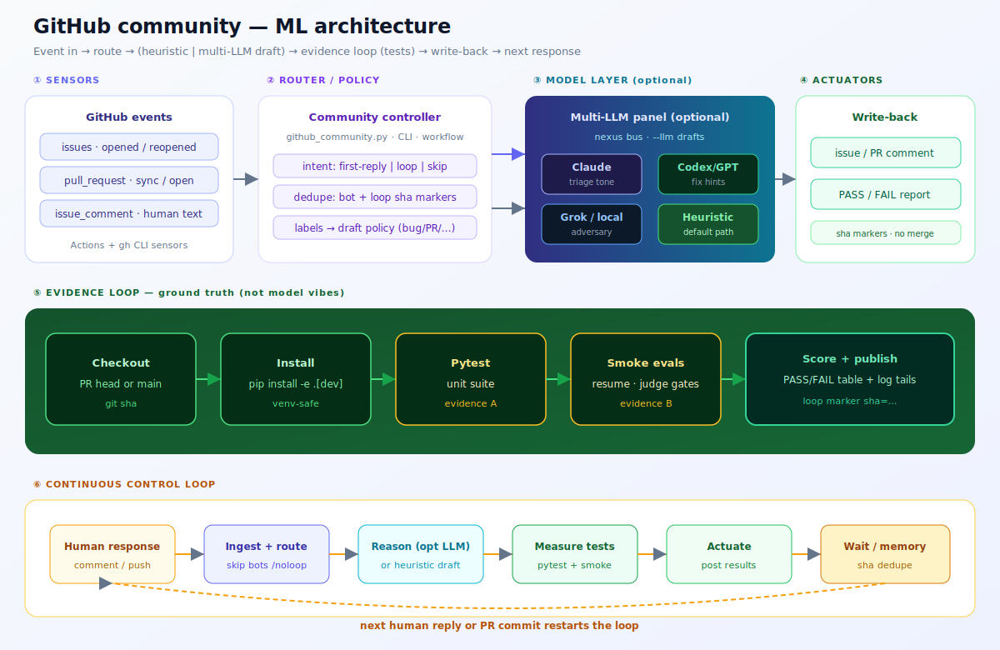

# GitHub community one-stop shop

Reply to **issues**, **pull requests**, and comments from one place — automatically on GitHub, and interactively from your laptop.

**You can use this on your own personal repos when you create them.** The loop is the same: respond → test → share → repeat. Turn on **fully autonomous** if you want it to keep running, and feed **new arXiv papers** into the improve path so research keeps pushing the code.

## Personal repos + full autonomy + other-repo scout + arXiv

| Goal | Command |
|------|---------|
| Enable loop on a **new/existing personal project** | `nexus github init --path ~/code/my-app` |
| Always-on **machine-local** loop | `nexus github watch --repo YOU/my-app --autonomous --interval 120` |
| One poll cycle (debug) | `nexus github watch --once --autonomous` |
| **Search other repos** | `nexus github search "topic" --limit 10` |
| Scout repos → local notes | `nexus github scout "topic" --workdir .` |
| Pull papers → notes (+ issue) | `nexus github improve --arxiv "topic" --repo YOU/my-app` |
| Papers **+** other repos | `nexus github improve --arxiv "topic" --with-scout` |
| Scout / papers → **try apply** via `nexus do` | `… --apply` |
| Continuous: comments + arXiv + scout | `watch --autonomous --arxiv "…" --scout "…" --scout-every 43200` |

```text
create personal repo
      → nexus github init
      → push community-bot.yml
      → Actions: cloud loop on every comment/PR
      → on your machine: watch --autonomous
      → search/scout other GitHub repos for ideas
      → improve --arxiv + --scout for research fuel
      → optional: --apply to run repair jobs
```

Portable workflow template: `connectors/examples/community-bot.workflow.yml`

**Safety:** autonomy is **opt-in**. Without `--autonomous`, `watch` only observes. Without `--apply`, improve/scout only write notes (and can open a tracking issue). Nothing auto-merges. Scout does not clone arbitrary code into your tree unless you pass `--apply` (which runs the jailed `nexus do` job).

## ML architecture



| Layer | Role |
|-------|------|
| Sensors | GitHub issues / PRs / comments |
| Router / policy | first-reply vs loop vs skip; label drafts; sha markers |
| Model layer (optional) | multi-LLM panel via NEXUS bus (`--llm`); heuristic default |
| Actuators | comments only (no auto-merge) |
| Evidence loop | install → pytest → smoke → PASS/FAIL |
| Control loop | next human reply restarts the cycle |

**Tests are the reward signal** — language models may draft text; loop outcomes only come from real checks.

## Response loop (the main automation)

```text
human response (comment)  or  new PR commits
        │
        ▼
  pick up the thread (#N)
        │
        ▼
  checkout code (PR head or main)
        │
        ▼
  pip install -e ".[dev]"
  pytest -q
  python evals/smoke.py   # if present
        │
        ▼
  post PASS/FAIL + log tails on the issue/PR
        │
        └──► next response → run again
```

| Trigger | What runs |
|---------|-----------|
| Issue or PR **opened / reopened** | First greeting **and** baseline test loop on default branch / PR head |
| **Human comment** on issue or PR | Test loop (skip bot comments and `/skip-loop`) |
| PR **synchronize** (new commits) | Test loop on the new head SHA |
| `@nexus` / `/triage` | First-reply style triage (if not already greeted) |
| `nexus github loop N` | Same loop locally with your `gh` token |

Results include marker `<!-- nexus-community-loop sha=… -->` so the **same commit is not reported twice** (use `--force` to override).

## Two layers

| Layer | What it does | Where |
|-------|----------------|-------|
| **GitHub Actions bot** | First reply + continuous test loop | `.github/workflows/community-bot.yml` on **VincentMarquez/nexus-core** |
| **Local CLI** | Inbox, drafts, reply, **loop**, bulk auto | `nexus github …` |

## Enable (this repo)

Already pushed to **https://github.com/VincentMarquez/nexus-core**.

1. **Settings → Actions → General → Workflow permissions** → allow read/write for `GITHUB_TOKEN` if needed.  
2. Comment on any open issue → within a few minutes you should see a **Community loop — test results** comment.  
3. Day-to-day: `nexus github inbox` and `nexus github loop <n>`.

No extra secrets for heuristic replies or the pytest/smoke loop.

## Local one-stop shop

```bash
gh auth login
cd nexus-core && make install

nexus github status
nexus github inbox
nexus github draft 12
nexus github reply 12
nexus github loop 12              # run tests + post results
nexus github loop 12 --dry-run    # print path without posting
nexus github loop 12 --force      # re-post even if same sha
nexus github auto --dry-run
```

## Trigger rules (Actions)

| Event | First reply | Test loop |
|-------|-------------|-----------|
| `issues` opened / reopened | yes | yes (main) |
| `pull_request` opened / reopened | yes | yes (PR head) |
| `pull_request` synchronize | no | yes (new commits) |
| `issue_comment` (human) | only if `@nexus` / `/triage` | **yes** (always, unless skip) |
| Bot comments / loop markers | ignored | ignored |
| `/skip-loop` or `/noloop` in comment | — | skipped once |

## Safety

- Only fixed commands run: `pip install -e ".[dev]"`, `pytest`, `evals/smoke.py` — **not** shell from the issue body.  
- Bot senders ignored → no infinite comment loops.  
- Same SHA not re-posted.  
- Autonomy remains opt-in for merges/pushes; this loop **reports**, it does not merge.

## Cookbook

[09 — Community inbox & auto-reply](cookbook/09_github_community.md)
