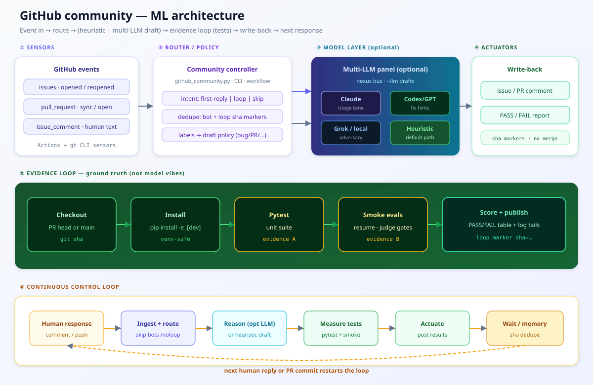

# GitHub community one-stop shop

Reply to **issues**, **pull requests**, and comments from one place—through a
local CLI or an optional GitHub Actions workflow.

> **Trust boundary:** testing a checkout installs and executes
> repository-controlled code. The bundled write-capable workflow executes the
> default branch and same-repository PR branches only; it does not execute fork
> PR heads. Treat same-repository branches as trusted. Test untrusted forks only
> in a separate read-only, secret-free workflow.

## Local observation, response, and research

| Goal | Command |
|------|---------|
| Enable loop on a **new/existing personal project** | `nexus github init --path ~/code/my-app` |
| Always-on **machine-local** loop | `nexus github watch --repo YOU/my-app --autonomous --interval 120` |
| One poll cycle (debug) | `nexus github watch --once --autonomous` |
| **Search other repos** | `nexus github search "topic" --limit 10` |
| Scout → **clone/pull + prove** | `nexus github scout "topic" --workdir . --connect` |
| Connect one external repo | `nexus github connect owner/repo` |
| Pull papers → notes (+ issue) | `nexus github improve --arxiv "topic" --repo YOU/my-app` |
| Papers **+** other repos | `nexus github improve --arxiv "topic" --with-scout` |
| Scout → **try apply** via `nexus do` | `nexus github scout "topic" --apply` |
| Continuous: comments + arXiv + scout | `nexus github watch --autonomous --arxiv "topic" --scout "topic" --scout-every 43200` |

```text
create personal repo
      → nexus github init
      → review community-bot.yml + NEXUS_COMMUNITY.md
      → push only after reviewing permissions and trust boundaries
      → Actions: issue loop + trusted same-repository PR loop
      → on your machine: watch --autonomous
      → search/scout other GitHub repos for ideas
      → improve --arxiv + --scout for research fuel
      → optional: --apply to run repair jobs
```

Portable workflow template: `connectors/examples/community-bot.workflow.yml`

**Connect + prove:** scout/connect use **shallow clone** and `git pull
--ff-only` only (never push to their remotes). Proof is the default and can run
install/test commands under `.nexus_workspaces/scout_repos/`. Use
`--structure-only` to inspect layout without installs/tests, `--no-prove` to
skip proof, or `--no-connect` for search-only.

Without `--autonomous`, `watch` only observes. Without `--apply`, improve writes
notes and can open a tracking issue after scouting. Nothing auto-merges.
However, proof and test paths still execute the selected checkout; the command
allowlist and project-root checks are guardrails, not a sandbox.

## ML architecture



| Layer | Role |
|-------|------|
| Sensors | GitHub issues / PRs / comments |
| Router / policy | first-reply vs loop vs skip; label drafts; sha markers |
| Model layer (optional) | multi-LLM panel via NEXUS bus (`--llm`); heuristic default |
| Actuators | comments only (no auto-merge) |
| Evidence loop | install → pytest → smoke → PASS/FAIL |
| Control loop | next human reply restarts the cycle |

**Tests are the reward signal** — language models may draft text; loop outcomes only come from real checks.

## Response loop (the main automation)

```text
human issue response  or  trusted same-repository PR commit
        │
        ▼
  pick up the thread (#N)
        │
        ▼
  checkout code (trusted PR head or default branch)
        │
        ▼
  pip install -e ".[dev]"
  pytest -q
  python evals/smoke.py   # if present
        │
        ▼
  post PASS/FAIL + log tails on the issue/PR
        │
        └──► next response → run again
```

| Trigger | What runs |
|---------|-----------|
| Issue **opened / reopened** | Greeting + test loop on the default branch |
| PR **opened / reopened** | Greeting for any PR; test loop only for a same-repository head |
| Human comment on an **issue** | Test loop on the default branch (skip bot comments and `/skip-loop`) |
| Human comment on a **PR** | No automatic test loop |
| PR **synchronize** (new commits) | Test loop only for a same-repository head |
| `@nexus` / `/triage` | First-reply triage using the trusted default branch |
| `nexus github loop N` | Same loop locally with your `gh` token |

Results include marker `<!-- nexus-community-loop sha=… -->` so the **same commit is not reported twice** (use `--force` to override).

## Two layers

| Layer | What it does | Where |
|-------|----------------|-------|
| **GitHub Actions bot** | First reply + continuous test loop | `.github/workflows/community-bot.yml` on **VincentMarquez/nexus-core** |
| **Local CLI** | Inbox, drafts, reply, **loop**, bulk auto | `nexus github …` |

## Enable in a trusted repository

`nexus github init` writes `.github/workflows/community-bot.yml` and
`NEXUS_COMMUNITY.md`. Review both before committing them.

1. Confirm that only trusted contributors can trigger code-executing paths.
2. Review workflow triggers, checkout refs, token permissions, and secrets.
3. Protect the default branch.
4. Enable only the minimum GitHub token permissions needed.
5. Test with `workflow_dispatch` on a trusted commit.

For public fork contributions, redesign the workflow as a read-only,
secret-free test job plus a trusted reporting job before enabling it.

## Local one-stop shop

```bash
gh auth login
cd nexus-core
make install
source .venv/bin/activate

nexus github status
nexus github inbox
nexus github draft 12
nexus github reply 12
nexus github loop 12              # run tests + post results
nexus github loop 12 --dry-run    # print path without posting
nexus github loop 12 --force      # re-post even if same sha
nexus github auto --dry-run
```

## Trigger rules (Actions)

| Event | First reply | Test loop |
|-------|-------------|-----------|
| `issues` opened / reopened | yes | yes (main) |
| `pull_request` opened / reopened | yes | same-repository PR head only |
| `pull_request` synchronize | no | same-repository PR head only |
| `issue_comment` on an issue | only if `@nexus` / `/triage` | yes, unless skipped |
| `issue_comment` on a PR | only if `@nexus` / `/triage` | no |
| Bot comments / loop markers | ignored | ignored |
| `/skip-loop` or `/noloop` in comment | — | skipped once |

## Safety

- The first-reply job always checks out the default branch. The response job
  checks out the default branch or a same-repository PR head and executes its
  Python code. Fixed command text does not make project code safe.
- Fork PR heads are excluded from the response job. Add a separate
  read-only, secret-free test workflow if public fork testing is required.
- Do not run untrusted pull-request code in a job with `issues: write`,
  `pull-requests: write`, repository secrets, or other write credentials.
- Bot senders are ignored to prevent comment loops, and the same SHA is not
  re-posted by default. Those controls do not provide execution isolation.
- The response loop reports results and does not merge, but a compromised
  write-capable token can still alter issues or pull-request comments.
- Run the local loop only against trusted checkouts or in an isolated,
  credential-free environment.

See [security and trust boundaries](SECURITY.md) and
[repository execution safety](cookbook/06_github_do.md#safety).

## Cookbook

[09 — Community inbox & auto-reply](cookbook/09_github_community.md)
