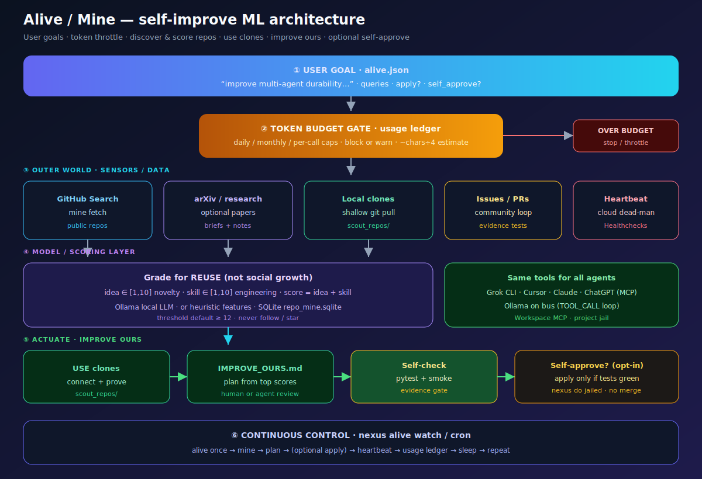

# Repo mine — use other codebases (don’t follow people)

ML architecture (alive + mine + budget): 

Inspired by tools like [yumiaura/followme](https://github.com/yumiaura/followme), but with a different endgame:

| followme | NEXUS `github mine` |
|----------|---------------------|
| fetch → evaluate → **follow** → **star** | fetch → evaluate → **connect/prove** → **use notes** |
| grows your social graph | grows **your local library of proven repos** |
| needs `user:follow` token | only needs `gh` search/clone (public) |

## Pipeline

```text
GitHub Search
    → SQLite (.nexus_state/repo_mine.sqlite)
    → shallow clone + Ollama (or heuristic) grade idea/skill
    → keep score ≥ threshold
    → clone/pull into .nexus_workspaces/scout_repos/
    → optional install/test prove
    → USE_LATEST.md  (how to port into *your* project)
```

**Never** calls GitHub follow or star APIs.

## Commands

```bash
# Full pipeline once
nexus github mine run -q "multi agent durable" -n 8 --min-score 12

# Step by step
nexus github mine fetch -n 10 -q "orchestrat LLM" --language Python --max-stars 500
nexus github mine evaluate -l 10                 # Ollama if up, else heuristic
nexus github mine evaluate -l 10 --heuristic-only
nexus github mine use --min-score 12 --limit 5   # keep winners for your code
nexus github mine list
nexus github mine list --used
```

## Scoring

- `idea` 1–10 novelty  
- `skill` 1–10 engineering  
- **score** = idea + skill (threshold default **12**, range 2–20)  

Ollama prompt grades for **reuse**, not social popularity.

## After mine — improve **our** code

```bash
ls .nexus_workspaces/scout_repos/
less .nexus_state/repo_mine/USE_LATEST.md

# Plan from top scores (always safe)
nexus github mine improve-ours --min-score 12
less .nexus_state/repo_mine/IMPROVE_OURS.md

# Port patterns into THIS project (opt-in durable job)
nexus github mine improve-ours --apply --repo VincentMarquez/nexus-core
make demo-all-quick
```

Full pipeline with plan step:

```bash
nexus github mine run -q "multi agent" --improve
nexus github mine run -q "multi agent" --improve --apply --repo YOU/REPO
```

## vs `github scout`

| | `scout` | `mine` |
|--|---------|--------|
| State | latest notes JSON | durable SQLite of many runs |
| Grade | informal | idea+skill scores |
| Goal | one-shot related digests | continuous library of **useable** clones |
