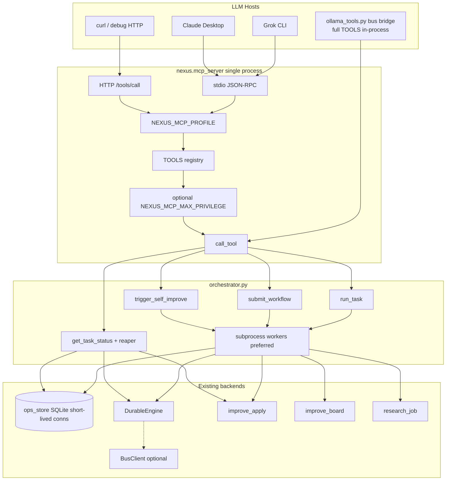
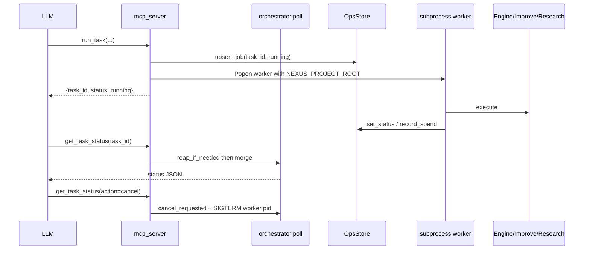

# Nexus Orchestration MCP Surface — “Nexus as a tool for Grok and other LLMs”

| Field | Value |
|-------|--------|
| **Document** | Design: Orchestration MCP tool surface |
| **Author** | TBD (Nexus maintainers) |
| **Date** | 2026-07-16 |
| **Status** | Draft (rev 2.2 — WAL always-on decision) |
| **Primary repo** | this repository (clone path varies) |
| **Related package** | `nexus-multi-agent` v0.9.1 (`pyproject.toml`) |
| **Existing server** | `nexus-workspace` v0.7.4, protocol `2024-11-05` (`src/nexus/mcp_server.py`) |

---

## Overview

Today Grok CLI and local LLMs (Gemma NVFP4 on vLLM `:8000`, Ollama `gemma4:26b`) treat Nexus primarily as a **codebase to edit** via workspace FS tools (`read_project_file`, `write_to_project`, …). Nexus already has durable orchestration internals—`DurableEngine`, improve-apply FSM, ops plane, research runners, heartbeats—but most of that power is only reachable via CLI (`nexus task …`, `nexus improve …`) or low-level MCP tools that require deep product knowledge.

This design **inverts the relationship**: Nexus becomes an **MCP tool surface** that LLMs call to (1) delegate multi-step work, (2) leverage resilience (checkpoints, retries, spend caps), and (3) trigger self-improvement cycles—without reimplementing orchestration in the model prompt.

We will **extend the existing `nexus-workspace` MCP process** with a small set of orchestration facades and an optional **tool profile** filter. Existing **38** tools stay registered and binary-compatible. New primary tools are thin, opinionated wrappers over `ops_store`, `engine`, `improve_apply`, `apply_select.improve_board`, and `research_job`—not a greenfield server.

**Per-PR capability matrix (summary):** facades land **complete for their PR scope**, never as half-registered stubs under a version bump. See [PR Plan](#pr-plan) and [Capability matrix by PR](#capability-matrix-by-pr).

---

## Background & Motivation

### Current state (grounded)

| Layer | What exists | Path / symbol |
|-------|-------------|---------------|
| MCP server | Stdio JSON-RPC + optional HTTP (`nexus mcp --http --port 8765`) | `src/nexus/mcp_server.py` |
| Server identity | `SERVER_NAME="nexus-workspace"`, `SERVER_VERSION="0.7.4"`, `PROTOCOL_VERSION="2024-11-05"` | same |
| Project jail | `NEXUS_PROJECT_ROOT` + `_safe_path()` | `mcp_server._root`, `_safe_path` |
| Grok wiring (operator env) | `[mcp_servers.nexus-workspace]` → `.venv/bin/python -m nexus.mcp_server` | `~/.grok/config.toml` (host config, not in repo) |
| Durable tasks | `Task` / `TaskStatus` / `DurableEngine.run` / `resume` | `src/nexus/engine.py` |
| Ops plane | SQLite jobs + spend | `src/nexus/ops_store.py` — `JOB_STATUSES`, `JOB_KINDS` |
| Improve apply | Phase FSM `briefed→context_packed→applying→audited→done`, `dry_run=True` default | `src/nexus/improve_apply.py` — `start_run`, `resume_or_start` |
| Improve spine | Stages `scouted→graded→apply_pending`, ledger | `src/nexus/improve_spine.py` (power-user / `ledger_*` tools; **not** a v1 facade mode) |
| Run status | `get_run_status` / `get_run_checkpoint` | MCP → `grade_artifact.py` |
| Bus | Optional; `bus_status` fail-soft | `runtime.py`, `bus_client.py`, `mcp_server` `bus_status` handler |
| Privilege **catalog** | `TOOL_PRIVILEGE` read/write/ops/admin | `src/nexus/tool_catalog.py` — used for OpenAPI / `max_privilege` **filter export only today** |
| Privilege **enforcement** | **Not present** in `call_tool` | Gap this design closes optionally via `NEXUS_MCP_MAX_PRIVILEGE` |
| Local LLM tools | Bus bridge imports full `TOOLS` + `call_tool` | `bridge/bridges/ollama_tools.py` — **in-process; ignores host profile env** |
| Usage caps | Daily/monthly token budgets | `src/nexus/usage.py` — `check_budget`, `BudgetExceeded` |
| Metrics (optional) | `record_task_event`, `counter`, `histogram` when `NEXUS_METRICS=1` | `src/nexus/metrics.py` |
| Improve env gate | **Does not exist today** | Only analogous pattern: `NEXUS_ALLOW_REBOOT` in `recovery.py` |
| Agent roles (demo) | `operator`, `planner`, `adversary`, `implementer`, `tester`, `reviewer`, `logger`, `local` | `AgentPanel.demo()` in `agents.py` |

**Exact tool list today (38):**  
`list_project_files`, `read_project_file`, `write_to_project`, `send_to_workspace`, `read_workspace_chat`, `nexus_status`, `run_project_checks`, `bus_status`, `github_community_status`, `list_platforms`, `github_scout`, `github_loop`, `platforms_connect`, `apply_phase`, `context_get`, `context_set`, `handoff`, `demo_loop`, `ops_control`, `context_pack`, `gap_board`, `vault_status`, `list_graded_candidates`, `get_grade`, `index_workspace`, `search_evidence`, `apply_select`, `mine_eval_slice`, `improve_board`, `ledger_append`, `ledger_list`, `grade_get`, `work_ledger`, `get_run_checkpoint`, `get_run_status`, `skillpacks`, `tool_catalog`, `mcp_eval`.

### Pain points

1. **Discovery tax** — An LLM must chain `improve_board` → `apply_phase` → `get_run_status` → `ops_control` (or know CLI) instead of one “run this task” call.
2. **No first-class async task handle** — Long work often blocks the MCP request (e.g. `run_project_checks` timeout 180s/check, `demo_loop`, `apply_phase` advance=all). Hosts prefer **submit → poll**.
3. **Split identity** — Engine tasks under `.nexus_state/tasks/{id}.json`; improve-apply under its run dirs; ops under `.nexus_state/ops/ops.sqlite`. Clients need **one client-facing `task_id`** (ops job id) with legacy lookup best-effort only.
4. **Bus optional** — Multi-vendor bus is frequently down. Orchestration must not require bus UP.
5. **Memory pressure** — Operator env may run Gemma NVFP4 (~80–90 GiB resident; **operator claim, not a repo fact**). Orchestration MCP must stay **light** (no auto `nexus start`).

### Why now

Grok already has `nexus-workspace` enabled with full tool access (operator host). Local models execute the same tools on the host. Closing the orchestration gap is a **facade + async job** layer, not a rewrite of the engine.

---

## Goals & Non-Goals

### Goals

1. Expose orchestration facades with **stable, complete schemas per shippable PR** (not half-stub tools under a version bump).
2. Map facades onto existing modules—**no parallel orchestration engines**.
3. Async job model: client-facing `task_id` (= ops job id), status enum, cancel, log tail, TTL, spend attribution under project root.
4. Keep stdio + HTTP transports; do not break existing 38 tools or default Grok config.
5. Graceful bus-down: local/offline paths always work; bus-backed steps report `blocked` / degraded mode.
6. Safe by default: project jail, dry-run defaults for apply, usage/spend gates, no secret values via MCP (`vault_status` pattern). Optional runtime privilege ceiling when configured.
7. Coexist with large local models: MCP process stays thin; workers are opt-in and budgeted; default `wait=false`.
8. Incremental PR plan; independently reviewable merges with an explicit capability matrix.

### Non-Goals

- Replacing CLI (`nexus task`, `nexus improve`, …) or rewriting `DurableEngine`.
- Full MCP-over-SSE multi-tenant cloud product (HTTP remains demo/debug loopback-first).
- Auto-starting bus / Ollama / NVFP4 from MCP tool calls.
- Multi-tenant isolation beyond **one project root per MCP process**.
- Vendoring external “mission-control” trees.
- Real-time token streaming through MCP.
- Making improve_spine a first-class facade mode in v1 (ledger tools already cover it).
- Shipping procurement as a first-class `run_task.kind` in v1 (CLI remains `nexus procure`).

---

## Key Decisions

| # | Decision | Rationale |
|---|----------|-----------|
| **K1** | **Single process, dual profile** — extend `nexus-workspace`; optional second client entry with `NEXUS_MCP_PROFILE=orchestrator`. | Avoids double process cost; one `TOOLS[]` source of truth. |
| **K2** | **Facades, not duplicates** — wrap `ops_store` + engine / research / improve modules. Low-level tools remain. | Prevents dual status semantics; evals keep working. |
| **K3** | **Unified job registry in `OpsStore`** — client-facing `task_id` **is** the ops job `id`. Backend ids only in `meta.backend_id` / envelope. | Operators use `ops_control`; one list/show surface. |
| **K4** | **Async-by-default** — return immediately; execution via **subprocess worker** for durable work (threads only for sub-second board-style work). Sync `wait=true` opt-in, capped, discouraged under NVFP4. | Hosts restart MCP often; threads die with process. |
| **K5** | **Bus is optional** — never auto-start; `agent_mode=auto` → demo panel when bus down; `agent_mode=bus` + down → `blocked` with `bus_down`. | Matches `bus_status` fail-soft. |
| **K6** | **Privilege catalog tags + optional runtime gate** — new tools tagged in `TOOL_PRIVILEGE`. **Today `call_tool` does not enforce privilege.** Ship optional `NEXUS_MCP_MAX_PRIVILEGE` enforcement in the same PR that registers facades. Tags alone are not a security boundary. | Honest about current code; fail-closed when operator sets ceiling. |
| **K7** | **Self-improve defaults to dry-run** — same as `apply_phase`. Non-dry apply requires **new** dual gate: `dry_run=false` **and** env `NEXUS_ALLOW_IMPROVE_APPLY=1`, enforced in **`improve_apply`** (shared by CLI + MCP), not facade-only. | New contract; mirrors `NEXUS_ALLOW_REBOOT` double-gate style in `recovery.py`. |
| **K8** | **Version bump only when MVP facades are complete** — `SERVER_VERSION` → `0.8.0` when PR2 lands (`run_task` + `get_task_status` fully working). Later tools do not require another major bump; patch/minor as needed. Protocol stays `2024-11-05`. | Avoids advertising incomplete tools under 0.8.0. |
| **K9** | **`auto_approve=true` default** for MCP pipeline tasks; `false` → may stop at `waiting_human` mapped to ops `blocked`. | Unattended utility; HITL is explicit. |
| **K10** | **Cancel is `get_task_status(action=cancel)` only in v1** — no fifth top-level tool. | Smaller TOOLS growth; skillpack documents action. |
| **K11** | **`serverInfo.name`** = `nexus-orchestrator` only when `NEXUS_MCP_PROFILE=orchestrator`; otherwise `nexus-workspace`. | Clients can distinguish profiles; default entry unchanged. |
| **K12** | **Per-PR no stubs in `tools/list`** — a tool is registered only when its supported modes work; unsupported modes return structured `isError` with `code=not_implemented` only if the tool is already registered for other complete modes. | Fixes half-finished facade risk. |
| **K13** | **`NEXUS_ORCH=0` omits facades from `tools/list`** and refuses call with clear error (does not list “disabled” tools). Default: facades **on** after their shipping PR is merged and tests green. | Avoids model confusion. |
| **K14** | **MCP/orchestrator research adapter uses `with_brief=false` by default.** Client may pass `with_brief=true` only when `agent_mode` is `demo` or `bus` (not silently ignored). Library `ResearchJobRunner.run(with_brief=True)` default is **not** used as-is from the facade. | Avoids extra panel/LLM calls under NVFP4; PR1b acceptance criterion. |
| **K15** | **Terminal ops/envelope status is sticky.** Once status ∈ `{cancelled, completed, failed}`, worker status writes are no-ops (log-only) unless internal `force=True`. Cancel wins races against late completion. | Prevents completed overwriting cancelled after SIGTERM. |
| **K16** | **Cancel/resume enforcement lives in orchestrator, not `DurableEngine`.** `engine.resume` / `run` will happily continue `failed` tasks (`run` forces `status=running`). Workers and reaper must refuse re-enqueue when ops/envelope is `cancelled` or `meta.reason==cancelled` / `cancel_requested`. | Matches real `engine.py` behavior (verified). |
| **K17** | **Always enable SQLite WAL for every `OpsStore` DB** in `ops_store.OpsStore._init`: `PRAGMA journal_mode=WAL;` — not gated on orchestrator use. | Concurrent short-lived readers/writers (ops CLI, MCP, orch workers) need it globally; one code path, no dual modes. |

---

## Proposed Design

### Architecture



### Profile model (K1) — frozen allowlists

Env: `NEXUS_MCP_PROFILE` ∈ `all` | `workspace` | `orchestrator` (default **`all`**).

Implementation lives in `src/nexus/mcp_server.py` (or small helper `src/nexus/mcp_profiles.py` if preferred to keep allowlists testable without loading full server):

```python
PROFILE_ALLOWLISTS: dict[str, frozenset[str]] = {
    "workspace": WORKSPACE_TOOLS,
    "orchestrator": ORCHESTRATOR_TOOLS,
}
# "all" / unset → full TOOLS (no filter)
```

#### `workspace` (19 tools) — FS + chat + read status; no ops-start / improve-apply

Includes **write** FS tools (workspace collaboration) but **not** `run_project_checks`, `ops_control`, `apply_phase`, github mutate loops, or orchestration facades.

```text
list_project_files, read_project_file, write_to_project,
send_to_workspace, read_workspace_chat,
nexus_status, bus_status, list_platforms, github_community_status,
vault_status, list_graded_candidates, get_grade, search_evidence,
context_get, context_pack, get_run_checkpoint, get_run_status,
ledger_list, grade_get
```

**Explicitly excluded from workspace:** `run_project_checks`, `ops_control`, `apply_phase`, `demo_loop`, `gap_board`, `github_scout`, `github_loop`, `platforms_connect`, `index_workspace`, `apply_select`, `mine_eval_slice`, `improve_board`, `ledger_append`, `work_ledger`, `context_set`, `handoff`, `skillpacks`, `tool_catalog`, `mcp_eval`, and all orchestration facades.

#### `orchestrator` (base **29** existing tools + facades as shipped)

Read/status/ops/improve tools without raw project FS **write** by default (`write_to_project` omitted). Optional `NEXUS_MCP_ORCH_WITH_FS_WRITE=1` adds `write_to_project` + `send_to_workspace` (default off).

```text
# always in orchestrator profile (ORCHESTRATOR_TOOLS_BASE, n=29):
nexus_status, bus_status, list_platforms, github_community_status,
vault_status, list_graded_candidates, get_grade, search_evidence,
apply_select, improve_board, mine_eval_slice,
get_run_checkpoint, get_run_status, ledger_list, grade_get,
context_get, context_pack, context_set, handoff,
ops_control, apply_phase, demo_loop, gap_board, work_ledger,
tool_catalog, mcp_eval,
list_project_files, read_project_file, read_workspace_chat
# facades added only when NEXUS_ORCH!=0 and PR has shipped them:
run_task, get_task_status            # PR2
submit_workflow                      # PR4
trigger_self_improve                 # PR5
```

**Count source of truth:** implement frozensets in code; tests use `len(WORKSPACE_TOOLS) == 19` and `len(ORCHESTRATOR_TOOLS_BASE) == 29` (or `assert len(s) == len(ORCHESTRATOR_TOOLS_BASE)` against a golden sorted tuple so comments cannot drift). Do not hardcode a different number in prose.

**Explicitly excluded from orchestrator (default):** `write_to_project`, `send_to_workspace` (unless `NEXUS_MCP_ORCH_WITH_FS_WRITE=1`), `run_project_checks`, `github_scout`, `github_loop`, `platforms_connect`, `index_workspace`, `ledger_append`, `skillpacks`.

#### `all` (default)

Full `TOOLS` including every shipped facade (subject to `NEXUS_ORCH`).

#### Enforcement

- `tools/list` and HTTP `GET /tools` use filtered list.
- `call_tool`: if profile ≠ `all` and name ∉ allowlist → `isError` with `code=profile_denied`.
- **Tests:** `tests/test_mcp_profiles.py` — `len(WORKSPACE_TOOLS)==19`, `len(ORCHESTRATOR_TOOLS_BASE)==29`, subset of current `TOOLS` names.

#### Host profile vs bus bridge (ollama_tools)

| Caller | Sees profile filter? |
|--------|----------------------|
| Grok/Claude stdio MCP (spawns server with env) | Yes |
| HTTP MCP with env set | Yes |
| `bridge/bridges/ollama_tools.py` importing `TOOLS` / `call_tool` in-process | **No** — always full registry unless bridge is updated later |

Document this distinction; profile is **host-spawn only** in v1. Optional follow-up: `ollama_tools` reads `NEXUS_MCP_PROFILE` and filters catalog text.

Optional second Grok entry:

```toml
[mcp_servers.nexus-orchestrator]
command = "/path/to/nexus-core/.venv/bin/python"
args = ["-m", "nexus.mcp_server"]
enabled = true

[mcp_servers.nexus-orchestrator.env]
NEXUS_PROJECT_ROOT = "/path/to/nexus-core"
PYTHONPATH = "/path/to/nexus-core/src"
NEXUS_MCP_PROFILE = "orchestrator"
```

### Facade → backend mapping

| User-facing (docs) | TOOLS[] name | Primary backends | Existing MCP equivalents |
|--------------------|--------------|------------------|--------------------------|
| `nexus__run_task` | `run_task` | `ops_store` + `DurableEngine` / `ResearchJobRunner` | CLI `nexus task`, examples/run_demo_task.py |
| `nexus__get_task_status` | `get_task_status` | envelope + `OpsStore` + backend merge | `ops_control(show)`, `get_run_status` |
| `nexus__submit_workflow` | `submit_workflow` | custom `StepPolicy` + `DurableEngine` | engine P1.2 DAG |
| `nexus__trigger_self_improve` | `trigger_self_improve` | `improve_board` / `improve_apply` / `demo_loop` / `mine_eval_slice` | `apply_phase`, `improve_board`, … |

**Naming:** unprefixed snake_case in `TOOLS[]`. Host prefixes are client-side.

**Not a v1 facade backend:** `improve_spine` stage machine (use existing `ledger_*` / `work_ledger` / `mine_eval_slice`). Overview text that listed spine as a primary facade backend is **withdrawn** for v1.

### Kind → ops → backend mapping (required)

`ops_store.upsert_job` **silently coerces unknown kinds to `"other"`** (`ops_store.py` ~231–232). Facades must **never** pass unmapped kinds.

| MCP `run_task.kind` | Ops `JOB_KINDS` value | Backend adapter | v1 support |
|---------------------|----------------------|-----------------|------------|
| `task` | `task` | `DurableEngine` | **yes** (PR1b + PR2) |
| `research` | `research` | `ResearchJobRunner` with **`with_brief=false` by default (K14)** | **yes** (PR1b + PR2) |
| `other` | `other` | none | **reject** at facade with `code=invalid_kind` (reserved; do not accept as “do something”) |
| ~~`checks`~~ | — | — | **not in public enum v1** — use existing tool `run_project_checks` (sync) or future kind after `JOB_KINDS` extended |
| ~~`procurement`~~ | — | — | **not in public enum v1** — use `nexus procure` CLI |

**JOB_KINDS extension in PR1a:**

```python
JOB_KINDS = frozenset({
    "mine", "alive", "research", "github", "improve", "task",
    "workflow",  # NEW — submit_workflow only
    "other",
})
```

Do **not** add `checks` / `procurement` until adapters + filter UX exist. If a client sends unknown kind → structured error, **do not** call `upsert_job` with it (avoids silent `other`).

`submit_workflow` always uses ops kind `workflow`.  
`trigger_self_improve` always uses ops kind `improve`.

### Async job model



#### Client-facing ID rule (K3)

- **`task_id`** returned by facades **equals** ops job `id` **equals** envelope filename stem.
- For `kind=task` / workflow, engine checkpoint id is the **same string** (`Task.task_id == task_id`).
- For improve modes, `meta.backend_id` may equal improve `run_id` (often same as `task_id` if client did not pass separate `run_id`).
- **Legacy lookup** (IDs never registered via orch): `get_task_status` may best-effort merge engine / `grade_artifact.get_run_status` / improve_apply state **without** creating an ops row (read-only). Response sets `legacy=true`.

#### Status enum (unified)

Map into existing `ops_store.JOB_STATUSES`:

| Unified (`ops`) | Engine `TaskStatus` | Improve phase | Research |
|-----------------|---------------------|---------------|----------|
| `inbox` | `pending` | not started | `pending` |
| `running` | `running` | mid-phase | `running` |
| `blocked` | `waiting_human` | bus_down / budget / waiting gate | external wait |
| `completed` | `completed` | phase `done` + ok | success |
| `failed` | `failed` | audit/guard fail | error |
| `cancelled` | *no engine enum* — see cancel SM | cancel | cancel |

Detail strings (`waiting_human`, `phase=applying`) go in `detail`, not the enum.

#### Cancel state machine (K10 + K15 + K16)

Engine `TaskStatus` has **no** `cancelled` (`pending|running|waiting_human|completed|failed` only). Cancel is **ops + envelope + meta**, not a new engine enum.

**Critical (K16):** `DurableEngine.resume` / `run` do **not** refuse terminal or failed tasks. Verified in `engine.py`: `resume()` loads the task and calls `run(task)`; `run()` always does `task.status = TaskStatus.running` (line ~811) then continues from `current_step`. Therefore **orchestrator alone** must refuse re-enqueue / `--resume` when cancelled—never rely on the engine.

```text
cancel(task_id):
  1. Load envelope; if missing and no ops row → isError code=not_found
  2. If already terminal (completed|failed|cancelled) → return current status (idempotent)
  3. envelope.cancel_requested = true
     ops sticky set_status(cancelled)   # K15: terminal write; see sticky rules below
     envelope.status = cancelled
  4. If engine task exists:
       task.meta["cancel_requested"] = true
       task.meta["reason"] = "cancelled"   # advisory for humans/CLI; engine ignores
       atomic save checkpoint
       journal event: event="cancel_requested"
  5. If envelope.pid live and is orch worker (see PID ownership):
       SIGTERM; wait up to NEXUS_ORCH_CANCEL_GRACE_S (default 10);
       if still alive SIGKILL; clear pid
  6. Worker cooperative path (must check every boundary):
       engine: before each step in DurableEngine loop wrapper / adapter
       research: between search, each paper fetch/download, and brief (if any)
       if cancel_requested or ops status==cancelled:
         try set engine TaskStatus.failed + meta.reason=cancelled + meta.error=cancelled
         try ops/envelope status=cancelled (no-op if already terminal — K15)
         exit 0 from worker (do not call set_status(completed))
  7. Return get_status merge with status=cancelled
```

**Sticky terminal status (K15) — cancel vs completion race:**

```text
TERMINAL = {cancelled, completed, failed}

ops_store / envelope writer helper set_status_orch(job_id, new_status, *, force=False):
  cur = current status
  if cur in TERMINAL and new_status != cur and not force:
    append log only: {"event":"status_ignored","from":cur,"attempted":new_status}
    return cur   # no-op
  apply new_status

result_summary / success payload:
  workers may write result_summary only if status is still non-terminal
    OR status==completed (update in place)
  if status==cancelled: refuse to attach success result_summary
```

So if cancel lands first, a late `set_status(completed)` is **ignored**. If completed lands first, a late cancel is also sticky-terminal (idempotent return)—product choice: **cancel after completed is no-op** (already terminal). Tests: cancel mid-pipeline; cancel after worker finishes writing success path (simulated race).

**Resume / reaper after cancel (orchestrator only):**

```text
worker main / enqueue / reaper respawn:
  if ops.status == cancelled OR envelope.cancel_requested OR envelope.status == cancelled:
    do NOT call engine.resume or ResearchJobRunner
    clear pid; return
  if engine task.meta.get("reason") == "cancelled" or meta.get("cancel_requested"):
    do NOT resume   # belt-and-suspenders even if ops row lost
  # NOTE: engine.resume would otherwise continue a failed/cancelled-marked task
```

MCP v1 does not expose `force` re-enqueue. Optional later (out of scope): engine hard-refuse when `meta.reason==cancelled` for CLI safety.

**PID ownership:** do **not** call `RuntimeManager.stop(name)` for orch workers — that API stops **named bus/bridge processes** under `.nexus_state/pids/{name}.pid` (`runtime.py`). Orch maintains:

```text
.nexus_state/orchestrator/workers.json
  { "task_id": {"pid": 1234, "started_at": ..., "argv_marker": "nexus.orchestrator.worker"} }
```

Kill only if `/proc/{pid}/cmdline` contains marker `nexus.orchestrator.worker` (or envelope `pid_token`). Pattern for signals can **mirror** `RuntimeManager.stop` (SIGTERM→wait→SIGKILL) but is a **separate helper** `orchestrator.kill_worker_pid(pid)`.

#### Worker lifecycle & reaper (MCP process death)

Hosts routinely kill stdio MCP servers. **Threads die with the process; disk state survives.**

| Worker type | Survives MCP death? | Use for |
|-------------|---------------------|---------|
| `threading.Thread` | No | Only sub-second sync helpers (e.g. pure offline `improve_board` if still async-wrapped) |
| `subprocess` (`python -m nexus.orchestrator worker --task-id …`) | Yes (orphan until reaped) | **Default** for `task`, `research`, `workflow`, `apply`, `demo_loop`, `mine_slice` |

**Reaper algorithm** — called at the start of every `get_status` / `poll` and before counting concurrent slots:

```text
reap_if_needed(task_id) or reap_all():
  for each envelope with status in (running, inbox) or ops status running:
    if cancel_requested → finalize cancel if pid dead
    pid = envelope.pid
    if pid and not pid_alive(pid):
      # orphaned worker
      if backend in (engine, workflow) and checkpoint exists and not terminal:
        if envelope.resume_policy == "auto" (default for engine/workflow):
          if concurrent slots available:
            spawn worker with --resume task_id
            log event "reaped_respawn"
          else:
            set ops+envelope status=blocked, detail="worker_dead_waiting_slot"
        elif resume_policy == "manual":
          set status=blocked, detail="worker_dead_resume_manual"
      else:
        # research/improve partial: mark failed or blocked with worker_dead
        set status=failed, error="worker_dead", detail=last log line
    if pid is None and status==running and age > NEXUS_ORCH_STALE_S (default 30):
      treat as worker never started → respawn or failed

concurrent slot count:
  count envelopes with live pid OR (status==running and pid_alive)
  do not count blocked worker_dead_waiting_slot as active runner
  inbox jobs may start when slots free (scheduler tick on poll/submit)
```

**`resume_policy`:** stored on envelope; default `auto` for engine/workflow, `manual` for improve non-dry (safety).

Document clearly: **in-process threads are best-effort and do not survive MCP death.**

#### Storage layout

```text
$NEXUS_PROJECT_ROOT/
  .nexus_state/
    ops/ops.sqlite
    tasks/{task_id}.json
    tasks/{task_id}.events.jsonl
    orchestrator/
      jobs/{task_id}.json
      logs/{task_id}.jsonl
      workers.json
    usage/
```

#### TTL & GC

- Default TTL **7 days** after terminal (`NEXUS_ORCH_TTL_S=604800`).
- Sanitize `task_id`: `[A-Za-z0-9._-]+`, max 80 chars; reject path separators.
- Submit rate limit: `NEXUS_ORCH_MAX_SUBMITS_PER_HOUR` default **60** per project root (file counter under `orchestrator/rate.json`).

#### Concurrency & resources

- `NEXUS_ORCH_MAX_CONCURRENT` default **2**.
- All orch kinds set `requires_gpu=false` in envelope (workers never load models).
- `wait=true` max `wait_timeout_s` default 120, hard cap 300; **document: hosts must keep `wait=false` when NVFP4/vLLM is loaded** (blocks MCP tool thread).
- Optional soft signal (not required for MVP): if `http://127.0.0.1:8000/v1/models` responds, log warning when concurrent>1 — detection only, no auto throttle beyond docs.
- Research facade: `max_results` default **5**, hard max **15** (not ResearchJobRunner’s 8 unbounded from MCP).
- **SQLite (K17):** never share one `OpsStore` connection across threads. Pattern: `with OpsStore.open(root) as store:` per submit/poll/spend call (short-lived connections). **Always** enable WAL in `OpsStore._init` for all DBs: `PRAGMA journal_mode=WAL;` (not orchestrator-only). No `check_same_thread=False` required if connections are not shared.

### Worker implementation

New module: **`src/nexus/orchestrator.py`**.

CLI entry for workers: `python -m nexus.orchestrator worker --task-id ID` (or `nexus orch worker` in PR7).

#### DurableEngine construction (mandatory)

Wrong `Settings.state_dir` writes to **CWD** (`config.py` default `Path(".nexus_state")`), not the project jail. Existing correct MCP pattern (`context_pack` handler):

```python
root = Path(workdir).resolve()  # == NEXUS_PROJECT_ROOT
settings = Settings(state_dir=root / ".nexus_state", autonomy=False)
if agent_mode == "bus" or (agent_mode == "auto" and bus_up):
    from nexus.bus_client import BusClient
    from nexus.agents import AgentPanel
    panel = AgentPanel.from_bus(BusClient(), mock_fallback=True)
else:
    panel = AgentPanel.demo()
engine = DurableEngine(
    settings=settings,
    panel=panel,
    policy=policy,  # default or custom
    auto_approve=auto_approve,
)
```

**Unit test requirement:** `tmp_path` as root with `monkeypatch.chdir(other_dir)` so CWD ≠ root; assert checkpoint at `tmp_path / ".nexus_state" / "tasks" / f"{task_id}.json"`.

#### Budget / meta wiring for `kind=task`

| Arg | Lands in | Ignored for |
|-----|----------|-------------|
| `max_steps` | `task.meta["max_steps"]` | research |
| `max_tokens` | `task.meta["max_tokens"]` | research |
| `max_wall_s` | `task.meta["max_wall_s"]` | research |
| `success_criteria` | `Task.success_criteria` | research |
| `namespace` | `Task.namespace` default `proj/mcp` | research |
| `meta` (user) | shallow-merged into `task.meta` after validation | — |

User `meta` constraints: JSON object, max **8 KiB** serialized, max **32 keys**, no keys starting with `_` (reserved). Strip unknown control keys: `cancel_requested` from user meta.

#### Idempotent re-submit

If client passes existing `task_id`:

| Existing status | Behavior |
|-----------------|----------|
| missing | create new |
| `running` / `inbox` / `blocked` | return current status (`idempotent=true`), do not double-start |
| `completed` / `failed` / `cancelled` | `isError` `code=already_terminal` unless `force_new=true` (generates new id — not default) |

### `submit_workflow` — agents & norms

**Allowed agent vocabulary (v1):** exactly the demo panel roles:

```text
operator, planner, adversary, implementer, tester, reviewer, logger, local
```

(`AgentPanel.demo()` in `agents.py`.) Bus mode uses same **role** names via `from_bus` / `DEFAULT_ROLE_TO_BUS`.

- Validate every `steps[].agent` (string or each list element) ∈ allowed set at submit time → else `isError` `code=invalid_agent`.
- Max steps: **20**. Max total JSON payload for steps: **64 KiB**.
- `name` optional; default `workflow-{task_id}`.
- `StepDef.checkpoint`: schema default **true** for MCP (safer resume); note dataclass default in `steps.py` is `False` — **facade sets True when omitted**.
- **Norms:** custom workflows set `task.meta["enforce_norms"]=false` by default (default 10-step pipeline norms do not apply). Judge still runs per step using `success_criteria` / step outputs. Structural pre-gate uses each step’s `output_keys` if provided (optional field; default empty → structural skip).
- Example workflow (real roles):

```json
{
  "goal": "Produce DEMO_OK artifact via short DAG",
  "success_criteria": ["artifact contains DEMO_OK"],
  "steps": [
    {"number": 1, "name": "plan", "description": "Plan tiny artifact", "agent": "planner", "depends_on": [], "checkpoint": true},
    {"number": 2, "name": "implement", "description": "Write artifact", "agent": "implementer", "depends_on": [1], "checkpoint": true},
    {"number": 3, "name": "review", "description": "Review artifact", "agent": "reviewer", "depends_on": [2], "checkpoint": true, "human": false}
  ]
}
```

### Privilege model (honest + optional enforcement)

**Today:** `TOOL_PRIVILEGE` in `tool_catalog.py` tags tools for catalog/OpenAPI/`tool_catalog(max_privilege=…)` export. **`call_tool` does not check privilege.**

**This design:**

1. Add catalog tags for facades:

| Tool | Privilege |
|------|-----------|
| `run_task` | `ops` |
| `get_task_status` | `read` (`action=cancel` requires `ops` when enforcement on) |
| `submit_workflow` | `ops` |
| `trigger_self_improve` | `ops` (`dry_run=false` treated as `admin` when enforcement on) |

2. **New optional runtime gate** (same PR as facades register):

```text
NEXUS_MCP_MAX_PRIVILEGE=read|write|ops|admin  # unset = no runtime filter (compat)
```

In `call_tool`, before dispatch:

```python
if max_priv := os.environ.get("NEXUS_MCP_MAX_PRIVILEGE"):
    need = TOOL_PRIVILEGE.get(name, "ops")  # fail closed for unknown
    if action-specific bump:  # e.g. get_task_status cancel → ops
        need = bumped
    if PRIVILEGE_RANK[need] > PRIVILEGE_RANK[max_priv]:
        return error code=privilege_denied
```

Promote/non-dry improve is **not** secured by privilege tags alone: still requires **K7 env gate** inside `improve_apply`.

### Improve apply gate (new contract, K7)

**New env:** `NEXUS_ALLOW_IMPROVE_APPLY` — not in codebase today; add in PR5.

**Enforcement location:** `improve_apply.start_run` / transition into phase `applying` when `dry_run=False` (shared CLI + MCP):

```python
if not dry_run and os.environ.get("NEXUS_ALLOW_IMPROVE_APPLY") != "1":
    raise ApplyGateError(
        "non-dry improve apply refused: set dry_run=true or NEXUS_ALLOW_IMPROVE_APPLY=1"
    )
```

**MCP response when gate hits:**

```json
{
  "content": [{"type": "text", "text": "{...}"}],
  "isError": true
}
```

Text JSON body:

```json
{
  "schema": "nexus.orchestrator/v1",
  "code": "improve_apply_gated",
  "message": "non-dry improve apply refused: set dry_run=true or NEXUS_ALLOW_IMPROVE_APPLY=1",
  "task_id": null
}
```

If job already created and worker hits gate → ops `blocked`, `detail=improve_apply_gated` (not silent coerce).

---

## Concrete tool schemas + response contracts

### Error envelope (all facades)

When `isError=true`, text body is JSON:

```json
{
  "schema": "nexus.orchestrator/v1",
  "code": "not_found|invalid_kind|invalid_agent|already_terminal|profile_denied|privilege_denied|improve_apply_gated|not_implemented|validation_error|rate_limited|budget_exceeded",
  "message": "human readable",
  "task_id": "optional"
}
```

### 1. `run_task` (ships complete in PR2)

**inputSchema:**

```json
{
  "name": "run_task",
  "description": "Submit a durable Nexus task (async). Returns task_id (= ops job id). Poll with get_task_status. kind=task|research only in v1.",
  "inputSchema": {
    "type": "object",
    "properties": {
      "description": {"type": "string"},
      "kind": {"type": "string", "enum": ["task", "research"], "default": "task"},
      "task_id": {"type": "string"},
      "success_criteria": {"type": "array", "items": {"type": "string"}},
      "namespace": {"type": "string", "default": "proj/mcp"},
      "max_steps": {"type": "integer"},
      "max_tokens": {"type": "integer"},
      "max_wall_s": {"type": "integer"},
      "auto_approve": {"type": "boolean", "default": true},
      "agent_mode": {"type": "string", "enum": ["demo", "bus", "auto"], "default": "auto"},
      "wait": {"type": "boolean", "default": false},
      "wait_timeout_s": {"type": "number", "default": 120},
      "max_results": {"type": "integer", "default": 5, "description": "research only; hard max 15"},
      "with_brief": {
        "type": "boolean",
        "default": false,
        "description": "research only; K14 — default false (unlike ResearchJobRunner library default True). true requires agent_mode demo|bus|auto with reachable panel path"
      },
      "meta": {"type": "object"}
    },
    "required": ["description"]
  }
}
```

**Research adapter (PR1b):** always call  
`ResearchJobRunner.run(query=..., max_results=min(n,15), with_brief=bool(args.get("with_brief") or False), ...)`.  
If `with_brief=true` and panel unavailable, job continues with empty brief or `blocked` with `detail=brief_unavailable` (prefer empty brief + log warning for MVP).

**Success response (required keys):**

```json
{
  "schema": "nexus.orchestrator/v1",
  "task_id": "orch-a1b2c3d4e5",
  "status": "running",
  "kind": "task",
  "backend": "engine",
  "ops_job_id": "orch-a1b2c3d4e5",
  "poll_tool": "get_task_status",
  "idempotent": false,
  "created_at": 1720000000.0
}
```

### 2. `get_task_status` (ships complete in PR2)

**inputSchema:**

```json
{
  "name": "get_task_status",
  "description": "Poll orch job; runs reaper first. action=status|logs|cancel|result.",
  "inputSchema": {
    "type": "object",
    "properties": {
      "task_id": {"type": "string"},
      "action": {"type": "string", "enum": ["status", "logs", "cancel", "result"], "default": "status"},
      "log_tail": {"type": "integer", "default": 40},
      "include_checkpoint": {"type": "boolean", "default": false}
    },
    "required": ["task_id"]
  }
}
```

**Field-level merge:**

| Field | Source priority |
|-------|-----------------|
| `status` | ops job status (after reaper); if legacy-only, map engine/improve |
| `detail` | envelope.detail → engine status/step → improve phase |
| `progress` | engine: `{current_step, total_steps, pct}` from task; improve: phase index; research: papers count |
| `tokens` / `cost` | ops job aggregates (updated when worker calls `record_spend`); optional engine `cost()` if include deep |
| `logs_tail` | last N lines of orchestrator log jsonl (redacted) |
| `result` | only for `action=result` or terminal status: backend summary object |
| `legacy` | true if no orch envelope |

**Missing job:** `isError` `code=not_found` (not empty success).

**`action=result` shape:**

```json
{
  "schema": "nexus.orchestrator/v1",
  "task_id": "…",
  "status": "completed",
  "result": {
    "backend": "engine",
    "task_status": "completed",
    "current_step": 10,
    "artifact_keys": ["…"],
    "error": null
  }
}
```

**Log redaction:** drop lines matching `(?i)(api[_-]?key|secret|token|password)\s*[:=]`; truncate each line to 2k chars; max tail 200 lines.

### 3. `submit_workflow` (ships complete in PR4 — not registered before)

See also agent validation, norms, and example DAG in **submit_workflow — agents & norms**.

```json
{
  "name": "submit_workflow",
  "description": "Submit a structured DAG workflow (StepPolicy-shaped). Async; poll get_task_status. Agents must be demo/bus roles. Register only in PR4.",
  "inputSchema": {
    "type": "object",
    "properties": {
      "name": {
        "type": "string",
        "description": "Optional workflow label; default workflow-{task_id}"
      },
      "goal": {"type": "string"},
      "task_id": {"type": "string"},
      "steps": {
        "type": "array",
        "description": "Max 20 steps; max 64KiB total JSON",
        "items": {
          "type": "object",
          "properties": {
            "number": {"type": "integer"},
            "name": {"type": "string"},
            "description": {"type": "string"},
            "agent": {
              "description": "Role name or list; must be in operator|planner|adversary|implementer|tester|reviewer|logger|local",
              "oneOf": [
                {"type": "string"},
                {"type": "array", "items": {"type": "string"}}
              ]
            },
            "depends_on": {
              "type": "array",
              "items": {"type": "integer"},
              "default": []
            },
            "checkpoint": {"type": "boolean", "default": true},
            "human": {"type": "boolean", "default": false},
            "timeout_s": {"type": "integer"},
            "output_keys": {
              "type": "array",
              "items": {"type": "string"},
              "description": "Optional structural pre-gate keys"
            }
          },
          "required": ["number", "name", "description", "agent"]
        }
      },
      "success_criteria": {"type": "array", "items": {"type": "string"}},
      "namespace": {"type": "string", "default": "proj/mcp"},
      "auto_approve": {"type": "boolean", "default": true},
      "agent_mode": {
        "type": "string",
        "enum": ["demo", "bus", "auto"],
        "default": "auto"
      },
      "max_tokens": {"type": "integer"},
      "max_wall_s": {"type": "integer"},
      "wait": {"type": "boolean", "default": false},
      "wait_timeout_s": {"type": "number", "default": 120},
      "meta": {"type": "object"}
    },
    "required": ["goal", "steps"]
  }
}
```

**Success response (required keys):**

```json
{
  "schema": "nexus.orchestrator/v1",
  "task_id": "orch-…",
  "status": "running",
  "kind": "workflow",
  "backend": "workflow",
  "ops_job_id": "orch-…",
  "poll_tool": "get_task_status",
  "workflow_name": "…",
  "n_steps": 3,
  "idempotent": false,
  "created_at": 1720000000.0
}
```

**Errors:** `validation_error` (cycle/unknown dep via `StepPolicy.validate`), `invalid_agent`, `already_terminal`, `rate_limited`.

### 4. `trigger_self_improve` (ships complete in PR5 — not registered before)

**Modes (all implemented in PR5 before register):**

| mode | Behavior | dry_run |
|------|----------|---------|
| `board` | `apply_select.improve_board` (may run in-process; still creates ops job for attribution) | n/a |
| `apply` | `improve_apply.resume_or_start` + advance | default true |
| `demo_loop` | `context_store.run_demo_loop` | n/a |
| `mine_slice` | `mine_eval_slice.run_demo_slice` | n/a |
| `full` | single worker: board then conditional apply (no race) | default true |

```json
{
  "name": "trigger_self_improve",
  "description": "Start/resume a self-improvement cycle (async). dry_run=true by default. Non-dry requires NEXUS_ALLOW_IMPROVE_APPLY=1 (enforced in improve_apply). Register only in PR5.",
  "inputSchema": {
    "type": "object",
    "properties": {
      "module": {
        "type": "string",
        "description": "Area hint; appended to goal and stored in ops meta.module; boosts board query"
      },
      "goal": {
        "type": "string",
        "default": "self-improve nexus-core from mined repos + arXiv"
      },
      "task_id": {"type": "string", "description": "Client-facing id (= ops job id)"},
      "run_id": {
        "type": "string",
        "description": "improve_apply / spine-style run id; defaults to task_id"
      },
      "mode": {
        "type": "string",
        "enum": ["board", "apply", "demo_loop", "mine_slice", "full"],
        "default": "board"
      },
      "dry_run": {"type": "boolean", "default": true},
      "fixture": {
        "type": "string",
        "description": "Grade fixture path relative to project root (apply/mine_slice)"
      },
      "min_score": {"type": "number", "default": 10.0},
      "query": {
        "type": "string",
        "default": "",
        "description": "Board FTS/rank query; module may be merged in"
      },
      "advance": {
        "type": "string",
        "enum": ["status", "one", "all"],
        "default": "all",
        "description": "improve_apply advance (same semantics as apply_phase)"
      },
      "repo": {
        "type": "string",
        "description": "Optional repo pin for mine_slice / apply"
      },
      "wait": {"type": "boolean", "default": false},
      "wait_timeout_s": {"type": "number", "default": 120},
      "meta": {"type": "object"}
    }
  }
}
```

**`module` field:** `goal = f"{goal} [module={module}]"` when set; also `ops.meta.module` and board `query` boost. Not a separate code path.

**IDs:** always return `task_id` (ops). Also return `run_id` (`run_id` defaults to `task_id` if omitted).

**Success response (required keys):**

```json
{
  "schema": "nexus.orchestrator/v1",
  "task_id": "orch-…",
  "run_id": "orch-…",
  "status": "running",
  "kind": "improve",
  "mode": "board",
  "backend": "improve_board",
  "ops_job_id": "orch-…",
  "dry_run": true,
  "poll_tool": "get_task_status",
  "created_at": 1720000000.0
}
```

**Errors:** `improve_apply_gated`, `validation_error`, `not_implemented` (should not appear if PR5 complete), `rate_limited`.

---

## Happy-path examples

### A. `run_task` kind=task, agent_mode=demo

```text
1. Client:
   run_task({
     "description": "Write a tiny artifact that proves the durable pipeline works",
     "kind": "task",
     "success_criteria": ["artifact contains DEMO_OK"],
     "task_id": "orch-demo-1",
     "agent_mode": "demo",
     "auto_approve": true
   })

2. Files created under $NEXUS_PROJECT_ROOT:
   .nexus_state/ops/ops.sqlite          # job orch-demo-1 kind=task status=running
   .nexus_state/orchestrator/jobs/orch-demo-1.json
   .nexus_state/orchestrator/logs/orch-demo-1.jsonl
   .nexus_state/orchestrator/workers.json
   (worker starts)
   .nexus_state/tasks/orch-demo-1.json
   .nexus_state/tasks/orch-demo-1.events.jsonl

3. Immediate tool result:
   {"schema":"nexus.orchestrator/v1","task_id":"orch-demo-1","status":"running",
    "kind":"task","backend":"engine","ops_job_id":"orch-demo-1","poll_tool":"get_task_status",…}

4. Poll:
   get_task_status({"task_id":"orch-demo-1"})
   → progress.current_step increases; eventually status=completed
```

### B. `trigger_self_improve` mode=board

```text
1. trigger_self_improve({"mode":"board","goal":"self-improve nexus-core","module":"mcp_server"})
2. Ops job kind=improve; backend improve_board runs offline fixtures/digests
3. result includes ranked candidates JSON (capped); status=completed quickly
```

### Polling pattern (skillpack)

```text
1. submit → task_id
2. loop get_task_status until terminal or blocked
3. on blocked: surface detail; do not busy-spin < 2s
4. action=result or logs for artifacts
```

---

## Capability matrix by PR

| Capability | PR1a | PR1b | PR1c | PR2 | PR3 | PR4 | PR5 | PR6–7 |
|------------|------|------|------|-----|-----|-----|-----|-------|
| Envelope + ops `workflow` kind + poll/cancel skeleton + fake backend | ✓ | | | | | | | |
| Engine + research adapters + Settings root + subprocess worker + reaper | | ✓ | | | | | | |
| improve_board adapter (library) | | | ✓ | | | | | |
| MCP `run_task` + `get_task_status` + version 0.8.0 + privilege gate env + `NEXUS_ORCH` omit | | | | ✓ | | | | |
| Profiles allowlists | | | | | ✓ | | | |
| MCP `submit_workflow` complete | | | | | | ✓ | | |
| MCP `trigger_self_improve` all modes + improve_apply env gate | | | | | | | ✓ | |
| Docs / skillpack / optional CLI | | | | | | | | ✓ |

**No tool name appears in `tools/list` before its column is ✓.**

---

## API / Interface Changes

### Before

```text
ops_control / apply_phase / get_run_status / demo_loop  (knowledge-heavy)
CLI: examples/run_demo_task.py, nexus task …
```

### After (additive, staged)

```text
PR2+: run_task, get_task_status
PR4+: submit_workflow
PR5+: trigger_self_improve
```

### Python API

```python
# src/nexus/orchestrator.py
def submit_task(workdir, description: str, **opts) -> dict: ...
def submit_workflow(workdir, goal: str, steps: list[dict], **opts) -> dict: ...
def trigger_self_improve(workdir, **opts) -> dict: ...
def get_status(workdir, task_id: str, **opts) -> dict: ...
def cancel(workdir, task_id: str) -> dict: ...
def reap_if_needed(workdir, task_id: str | None = None) -> list[dict]: ...
```

### HTTP

Existing `POST /tools/call` only; no new routes.

---

## Data Model Changes

- Extend `JOB_KINDS` with `workflow` only (PR1a).
- Envelope JSON `nexus.orchestrator/v1` (task_id, backend, backend_id, status, pid, resume_policy, cancel_requested, ttl_s, request, result_summary, error, requires_gpu=false).
- No engine schema migration; `meta.cancel_requested`, `meta.reason=cancelled`, `meta.source=mcp:run_task`.
- **WAL always on (K17):** in `ops_store.OpsStore._init`, after schema create, execute `PRAGMA journal_mode=WAL;` for every ops DB (all callers: CLI `nexus ops`, MCP `ops_control`, orchestrator).

---

## Alternatives Considered

### A. Separate `nexus-orchestrator` process

Pros: smaller tool list. Cons: dual process, registry drift, memory. **Reject** as default; profile alias only.

### B. Docs-only chaining of 38 tools

Pros: zero code. Cons: fails product vision / small models. **Reject** as sole approach.

### C. Temporal/Celery cluster

Pros: industrial async. Cons: deps vs stdlib kit. **Reject**.

### D. Replace 38 tools with 4 facades

Pros: minimal list. Cons: breaks evals/cookbooks. **Reject**.

### E. Thin async wrappers around existing MCP tools only

Pros: no `orchestrator.py`; wrap `demo_loop` / `apply_phase` / `run_project_checks` with background + poll via `ops_control`. Cons: still three ID namespaces; no unified `run_task` for engine demos; workflow DAG still missing; status merge stays ad hoc. **Reject** as primary design; may inspire internal helpers.

### F. Extend `ops_control` with `action=submit|cancel` only

Pros: zero new tool names; better for tiny models. Cons: overloads an already multi-action ops tool; poor discoverability for LLMs (“mission control” vs “run my task”); schema becomes a god-object. **Reject** for primary UX; `ops_control` remains list/show/spend. Facades stay separate names.

---

## Security & Privacy Considerations

| Threat | Severity | Mitigation |
|--------|----------|------------|
| Path escape | High | `_safe_path` / project root; sanitize task_id |
| Secret leakage in results/logs | High | vault presence-only; log redaction; no `.env` reads in facades |
| Unbounded spend | High | `usage.check_budget`; max_tokens/wall; autonomy=False; concurrent caps |
| Destructive improve | High | dry_run default; **new** `NEXUS_ALLOW_IMPROVE_APPLY=1` in improve_apply |
| Privilege confusion | Med | Catalog tags alone ≠ auth; optional `NEXUS_MCP_MAX_PRIVILEGE` |
| `run_project_checks` / future checks kind (pytest RCE-adjacent if tree untrusted) | High | **Not** a `run_task` kind in v1; existing tool stays `ops` privilege; document trust model = project root is trusted code |
| Submit flood / disk fill | Med | `NEXUS_ORCH_MAX_SUBMITS_PER_HOUR`; TTL GC; meta size cap 8 KiB |
| Free-form `meta` control channel | Med | key count/size limits; strip reserved keys |
| Wrong PID kill | Med | cmdline marker check; not `RuntimeManager.stop` |
| HTTP bind | Med | default 127.0.0.1 |
| Prompt injection → dangerous DAG | Med | agent allowlist; no arbitrary shell kind; judge + optional human steps |

---

## Observability

| Signal | MVP | P2 |
|--------|-----|----|
| Ops status transitions on submit/run/complete/fail/cancel | **Required** | |
| Envelope + log jsonl | **Required** | |
| `ops_store.record_spend` when backend reports tokens | Best-effort (engine cost/journal when available) | Mandatory dual-write |
| `metrics.counter("nexus_orch_submit_total")` etc. via `metrics.counter` when `NEXUS_METRICS=1` | | Optional hooks |
| Heartbeat dead-man for host | Existing | |

MVP acceptance: ops row reaches a terminal or blocked status for every submit; no requirement on Prometheus.

**SLOs (lab host):** async submit p95 < 200 ms; poll p95 < 100 ms.

---

## Rollout Plan

1. **`NEXUS_ORCH`:** unset/`1` = facades that have shipped are listed; `0` = **omit from tools/list** + refuse call (`code=orch_disabled`).
2. Stage library PRs (1a–1c) without MCP registration.
3. PR2 dogfood: Grok `run_task` demo + research.
4. PR3 profiles for small models.
5. PR4–5 workflow + self-improve.
6. Rollback: `NEXUS_ORCH=0` or revert; no DB migration.

---

## Risks

| Risk | Severity | Mitigation |
|------|----------|------------|
| MCP kill mid-job | High | Subprocess + reaper on poll (specified) |
| SQLite locking / same-thread | Med | Short-lived `OpsStore.open` per op; WAL |
| Half-shipped tools | High | Capability matrix; no stubs in list |
| Silent kind→other | Med | Validate kinds before upsert_job |
| Wrong state_dir | High | Mandatory Settings construction + cwd test |
| wait=true freezes host under NVFP4 | Med | Default false; document; hard cap 300s |
| ollama sees full tools | Low | Document host-spawn vs in-process |

---

## Open Questions

1. ~~Research `with_brief` default~~ → **Resolved as K14** (`with_brief=false` for MCP/orchestrator adapter; explicit opt-in).
2. ~~WAL for all ops DBs vs orch-only~~ → **Resolved as K17**: always `PRAGMA journal_mode=WAL;` in `OpsStore._init` for everyone (not gated on orchestrator).
3. *(Resolved into K9–K17)* auto_approve, cancel tool, serverInfo, wait, version bump, NEXUS_ORCH list omit, research brief, sticky terminal, orchestrator-enforced cancel resume, WAL always-on.

---

## References

- `src/nexus/mcp_server.py` — MCP server, TOOLS, transports, `context_pack` Settings pattern  
- `src/nexus/engine.py` — `Task`, `TaskStatus`, `DurableEngine`  
- `src/nexus/ops_store.py` — jobs, spend, kind coerce, `note_improve_run`  
- `src/nexus/improve_apply.py` — phases, dry_run, start/resume  
- `src/nexus/improve_spine.py` — spine (power tools only for v1 facades)  
- `src/nexus/grade_artifact.py` — get_run_status, success_guard  
- `src/nexus/tool_catalog.py` — TOOL_PRIVILEGE, PRIVILEGE_RANK  
- `src/nexus/steps.py` — StepPolicy, StepDef  
- `src/nexus/agents.py` — AgentPanel.demo / from_bus roles  
- `src/nexus/research_job.py` — ResearchJobRunner  
- `src/nexus/runtime.py` — RuntimeManager (bus pids only)  
- `src/nexus/usage.py`, `src/nexus/metrics.py`, `src/nexus/recovery.py`  
- `bridge/bridges/ollama_tools.py`  
- `docs/ARCHITECTURE.md`, `docs/RESILIENCE.md`, `docs/MCP_SETUP.md`  
- `docs/cookbook/04_workspace_mcp.md`, `cookbook/12_task_operator.md`  
- `tests/test_mcp_server.py`, `tests/test_mcp_eval.py`  
- `skillpacks/durable-operator/`  

---

## Appendix A — Grounding citations (implementer quick ref)

| Claim | Citation |
|-------|----------|
| 38 tools, server name/version/protocol | `mcp_server.py` `SERVER_*`, `TOOLS` |
| Package version 0.9.1 | `pyproject.toml` `version` |
| JOB_STATUSES / JOB_KINDS | `ops_store.py` |
| Unknown kind → `"other"` | `ops_store.upsert_job` kind check |
| TaskStatus values | `engine.TaskStatus` |
| Settings.state_dir default CWD-relative | `config.Settings` |
| MCP context_pack uses root state_dir | `mcp_server.call_tool` `context_pack` branch |
| improve_apply dry_run default True | `start_run(..., dry_run=True)` |
| NEXUS_ALLOW_REBOOT only | `recovery.py` |
| Privilege not enforced in call_tool | no privilege check in `call_tool` body |
| Demo agent roles | `AgentPanel.demo` roles dict |
| RuntimeManager.stop(name) | `runtime.RuntimeManager.stop` |
| metrics optional | `metrics.enabled` via `NEXUS_METRICS` |
| ollama imports TOOLS fully | `ollama_tools._tool_catalog` |
| `resume()` does not refuse failed/completed | `engine.DurableEngine.resume` → always may call `run` |
| `run()` forces `status=running` | `engine.DurableEngine.run` ~line 811 |
| ResearchJobRunner `with_brief=True` default | `research_job.ResearchJobRunner.run` |

**Operator-env (not repo):** `~/.grok/config.toml` — **primary local model is `[model.gemma4]` → vLLM NVFP4** (`gemma4-nvfp4-interactive2` on `:8000`), not Ollama. Ollama is secondary (`nexus-local`). Same `mcp_servers.nexus-workspace` tools attach to Grok sessions on **either** model. NVFP4 RSS ~80–90 GiB; do not dual-load heavy Ollama with NVFP4.

---

## Appendix B — PROFILE_ALLOWLISTS (copy-paste)

```python
WORKSPACE_TOOLS = frozenset({
    "list_project_files", "read_project_file", "write_to_project",
    "send_to_workspace", "read_workspace_chat",
    "nexus_status", "bus_status", "list_platforms", "github_community_status",
    "vault_status", "list_graded_candidates", "get_grade", "search_evidence",
    "context_get", "context_pack", "get_run_checkpoint", "get_run_status",
    "ledger_list", "grade_get",
})  # n=19

ORCHESTRATOR_TOOLS_BASE = frozenset({
    "nexus_status", "bus_status", "list_platforms", "github_community_status",
    "vault_status", "list_graded_candidates", "get_grade", "search_evidence",
    "apply_select", "improve_board", "mine_eval_slice",
    "get_run_checkpoint", "get_run_status", "ledger_list", "grade_get",
    "context_get", "context_pack", "context_set", "handoff",
    "ops_control", "apply_phase", "demo_loop", "gap_board", "work_ledger",
    "tool_catalog", "mcp_eval",
    "list_project_files", "read_project_file", "read_workspace_chat",
})
# len(ORCHESTRATOR_TOOLS_BASE) == 29  — tests assert this; do not re-type a wrong n=

ORCHESTRATOR_FACADES = frozenset({
    "run_task", "get_task_status", "submit_workflow", "trigger_self_improve",
})  # added per capability matrix when shipped + NEXUS_ORCH
```

**Literal count check (29):**  
`nexus_status`, `bus_status`, `list_platforms`, `github_community_status`, `vault_status`, `list_graded_candidates`, `get_grade`, `search_evidence`, `apply_select`, `improve_board`, `mine_eval_slice`, `get_run_checkpoint`, `get_run_status`, `ledger_list`, `grade_get`, `context_get`, `context_pack`, `context_set`, `handoff`, `ops_control`, `apply_phase`, `demo_loop`, `gap_board`, `work_ledger`, `tool_catalog`, `mcp_eval`, `list_project_files`, `read_project_file`, `read_workspace_chat`.

---

## PR Plan

### PR 1a — Envelope, ops kind, poll/cancel skeleton

- **Title:** `feat(orchestrator): envelope store, workflow job kind, poll/cancel + fake backend`
- **Files:** NEW `src/nexus/orchestrator.py` (skeleton), `src/nexus/ops_store.py` (`workflow` kind; **K17** `PRAGMA journal_mode=WAL;` in `_init` for all OpsStore opens), NEW `tests/test_orchestrator.py` (fake backend only); optional assert in `tests/test_ops_store.py` that journal mode is WAL after open
- **Dependencies:** none  
- **Description:** create/poll/cancel envelope; rate limit counter; task_id sanitization; **no** real engine yet; WAL enabled globally in ops_store `_init`. Acceptance: fake job completes; cancel idempotent; unknown paths jailed; new ops DB uses WAL.

### PR 1b — Engine + research adapters, subprocess worker, reaper

- **Title:** `feat(orchestrator): DurableEngine/research adapters, subprocess worker, reaper`
- **Files:** `orchestrator.py`, `tests/test_orchestrator.py` (tmp_path ≠ CWD Settings test)
- **Dependencies:** PR 1a  
- **Description:** Mandatory `Settings(state_dir=root/".nexus_state")`; demo/bus panel; reaper algorithm; kill_worker_pid helper (not RuntimeManager); **K14** research `with_brief=false` default; **K15** sticky terminal `set_status`; **K16** worker/reaper refuse resume when cancelled (do not rely on `engine.resume`). Acceptance: demo pipeline completes under tmp_path; kill worker → reaper path; cancel mid-run stays `cancelled` even if worker tries `completed`; research adapter passes `with_brief=False` unless opted in.

### PR 1c — improve_board library adapter

- **Title:** `feat(orchestrator): improve_board adapter for ops-attributed board runs`
- **Files:** `orchestrator.py`, tests  
- **Dependencies:** PR 1a  
- **Description:** Offline board runs with ops kind=improve. No MCP tools yet.

### PR 2 — MCP `run_task` + `get_task_status` only (version 0.8.0)

- **Title:** `feat(mcp): run_task and get_task_status facades (orchestrator MVP)`
- **Files:** `mcp_server.py` (register **two** tools only; `SERVER_VERSION=0.8.0`), `tool_catalog.py`, optional `NEXUS_MCP_MAX_PRIVILEGE` gate in `call_tool`, `NEXUS_ORCH` list filter, `tests/test_mcp_server.py`, `fixtures/mcp_eval/packs/orchestrator_smoke.json`
- **Dependencies:** PR 1b  
- **Description:** Full schemas for task+research kinds; no submit_workflow / trigger_self_improve registration. Kill switch omits tools from list.

### PR 3 — Profiles

- **Title:** `feat(mcp): NEXUS_MCP_PROFILE workspace|orchestrator|all allowlists`
- **Files:** `mcp_server.py` or `mcp_profiles.py`, tests for frozenset membership/counts, `docs/MCP_SETUP.md`, `connectors/examples/orchestrator-mcp.client.json`
- **Dependencies:** PR 2  
- **Description:** Frozen allowlists per Appendix B; serverInfo rename on orchestrator profile; document ollama_tools in-process exception.

### PR 4 — `submit_workflow` complete

- **Title:** `feat(mcp): submit_workflow with agent allowlist and StepPolicy validation`
- **Files:** `orchestrator.py`, `mcp_server.py` (register tool), tests, connector example workflow JSON  
- **Dependencies:** PR 1b, PR 2  
- **Description:** Full validation (agents, max 20 steps, cycles); norms off by default for custom DAG; no stubs.

### PR 5 — `trigger_self_improve` + shared improve gate

- **Title:** `feat(improve+mcp): NEXUS_ALLOW_IMPROVE_APPLY gate and trigger_self_improve modes`
- **Files:** `improve_apply.py` (gate), `orchestrator.py`, `mcp_server.py` (register tool), tests  
- **Dependencies:** PR 1c, PR 2  
- **Description:** All modes board/apply/demo_loop/mine_slice/full; dual gate for non-dry; structured errors.

### PR 6 — Docs / skillpack

- **Title:** `docs: orchestration MCP poll loop and NVFP4 coexistence`
- **Files:** skillpack, cookbooks, PLATFORMS note on ollama full catalog  
- **Dependencies:** PR 2–5 as available (can partial-doc after PR2)

### PR 7 — Optional CLI `nexus orch`

- **Title:** `feat(cli): nexus orch submit|status|cancel|worker`
- **Files:** `cli.py`, tests  
- **Dependencies:** PR 1b+  

### Merge order

```text
PR1a → PR1b → PR2 → PR3
         ↘ PR1c → PR5
PR1b → PR4
PR2+ → PR6
PR1b+PR2 → PR7 (optional)
```

---

*End of design document (rev 2.2).*
