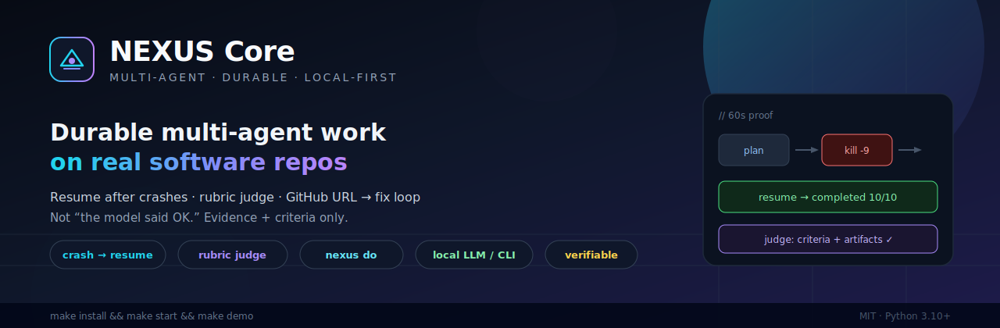

# NEXUS Core



**Multi-agent tasks that resume after a crash — with a judge that checks real success criteria, not “the model said OK.”**

## 60-second start

```bash
git clone https://github.com/VincentMarquez/nexus-core
cd nexus-core
./run                   # install + bus + dashboard + agents (auto)
nexus demo              # crash → resume
nexus stop
```

Agents (Claude / Codex / Gemini / Ollama) turn on automatically when installed; otherwise safe mocks run so nothing is blocked.

## What you get

| Capability | Docs |
|------------|------|
| Durable 10-step pipeline | [Pipeline](PIPELINE.md) |
| Rubric judge | [Architecture](ARCHITECTURE.md) |
| Local LLM + CLI bridges | [Bridges](BRIDGES_AND_BUS.md) |
| MCP for ChatGPT / Claude / Grok / phone | [Connectors](CONNECTORS.md) |
| GLM-5.2 / colibrì | [GLM-5.2](GLM52.md) |
| Cookbooks | [Cookbooks](cookbooks.md) |

## Figures

See [FIGURES.md](FIGURES.md) for all architecture diagrams.

## License

MIT · [GitHub](https://github.com/VincentMarquez/nexus-core)
