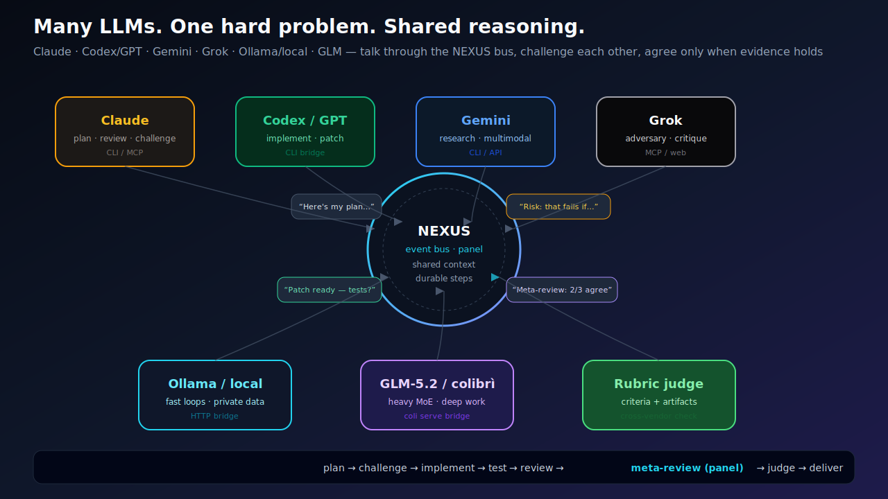

# NEXUS Core


**Many LLMs talk and reason together on hard problems.**

Claude · GPT/Codex · Gemini · Grok · Ollama · GLM — shared bus, adversarial challenge, meta-review, durable checkpoints, and a **rubric judge** that needs evidence.

Not a general “do anything” agent. A **specialized multi-agent orchestration engine** for software, arXiv research, and procurement.



## 60-second start

```bash
git clone https://github.com/VincentMarquez/nexus-core
cd nexus-core
./run                   # install + bus + dashboard + agents (auto)
nexus demo              # crash → resume
nexus stop
```

### Paste any GitHub repo

```bash
./run https://github.com/owner/repo
# clone → install → test → fix loop → NEXUS_REPORT.md
```

## Two pillars

1. **Reliability & verifiability** — durable checkpoints, rubric judge, adversarial pipeline  
2. **Practical engineering** — GitHub-native jobs, local LLMs/CLIs, dashboard  

[How we compare](COMPARE.md) to Cursor, LangGraph, CrewAI, AutoGen.

## What you get

| Capability | Docs |
|------------|------|
| Durable 10-step pipeline | [Pipeline](PIPELINE.md) |
| Rubric judge | [Architecture](ARCHITECTURE.md) |
| GitHub `nexus do` | [Cookbook 06](cookbook/06_github_do.md) |
| arXiv research | [Cookbook 08](cookbook/08_arxiv_research.md) · [Agent](agents/RESEARCH_ARXIV.md) |
| Procurement agents | [Cookbook 07](cookbook/07_procurement.md) · [Agent](agents/PROCUREMENT.md) |
| Local LLM + CLI bridges | [Bridges](BRIDGES_AND_BUS.md) |
| MCP for ChatGPT / Claude / Grok | [Connectors](CONNECTORS.md) |
| GLM-5.2 / colibrì | [GLM-5.2](GLM52.md) |
| Positioning vs other tools | [Compare](COMPARE.md) |
| All cookbooks | [Cookbooks](cookbooks.md) |

## Figures

See [FIGURES.md](FIGURES.md).

## License

MIT · [GitHub](https://github.com/VincentMarquez/nexus-core)
